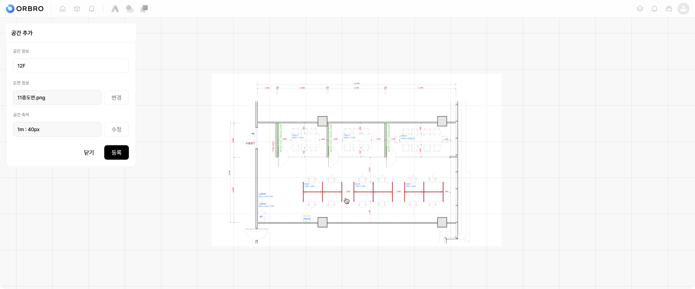

# 공간 추가

### 사용방법

1. 공간을 추가할 건물을 선택합니다.
2. 건물 이름 오른쪽에 있는 \[설정] 버튼을 클릭합니다.
3. 표시되는 컨텍스트 메뉴에서 \[공간 추가] 항목을 클릭합니다.
4. 공간 추가 전용 화면으로 이동합니다.
5. 공간 이름을 입력합니다. (예: 12F, 11F, B1, 야외 선착장 등)
6. \[도면 정보] 항목에서 \[추가] 버튼을 클릭합니다.
7. 팝업 탐색기 화면에서 업로드할 도면 이미지를 선택합니다.
   * 지원 형식: PNG, JPEG
8. 도면을 선택하면 미리보기 화면이 열립니다.
9. 도면을 확인한 후 \[추가] 버튼을 클릭하면 업로드가 완료됩니다.
10. 다른 도면으로 변경하고 싶은 경우 \[다른 파일 선택] 버튼을 클릭합니다.
11. 도면 업로드가 완료되면 공간 축척 항목이 자동으로 표시됩니다.
12. 기본값은 1m = 100px로 설정되어 있습니다.
13. \[수정] 버튼을 클릭한 후 도면 위에 기준선을 그립니다.
14. 기준선의 실제 길이(m)를 입력하면 축척이 자동으로 계산되어 적용됩니다.
15. \[저장] 버튼을 클릭하여 축척 설정을 완료합니다.

<figure><figcaption></figcaption></figure>


**참고사항**

* 도면 업로드 후에는 반드시 미리보기 화면을 통해 도면이 정확히 표시되는지 확인해야 합니다. 흐릿함이나 왜곡이 있는 경우 재업로드를 권장합니다.
* 지원 파일 형식은 PNG, JPEG이며 PDF나 DWG 형식은 변환 후 업로드해야 합니다.
* 공간 축척 설정은 거리 기반 위치 추적 기능에 직접적인 영향을 주므로 정확한 기준선 입력이 필수입니다.
* 도면 및 축척 정보를 나중에 변경할 경우, 연결된 기능 설정에 영향을 줄 수 있습니다.

