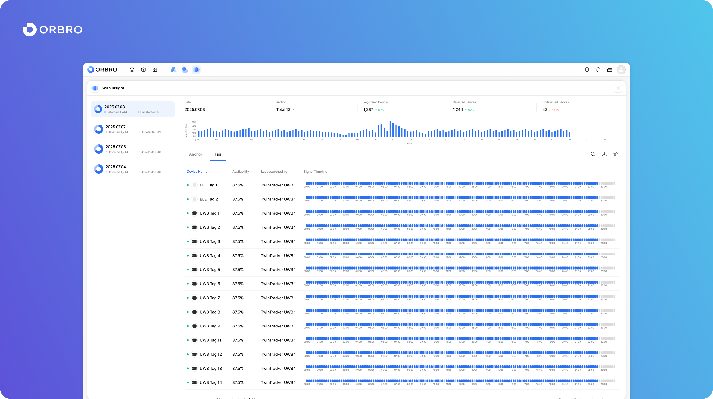
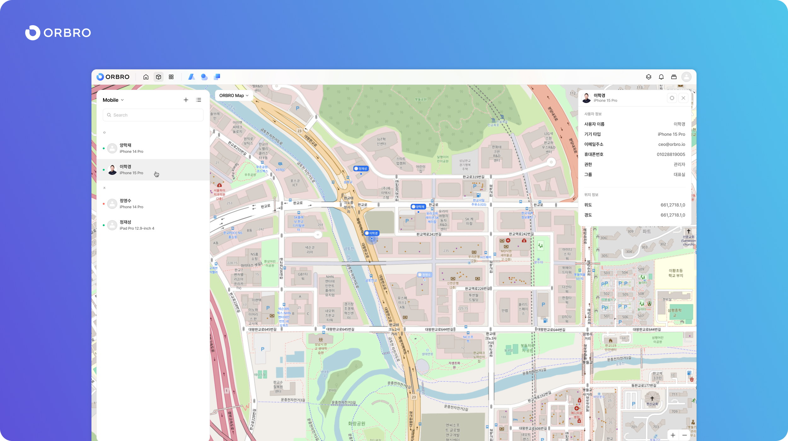

# 릴리즈 노트

## 2.9.0(2025.10.17)

#### Overview

ORBRO OS 2.9.0은 SOP(Application) 신설, Object 색상 커스터마이징 기능, Nearby Search 알고리즘 고도화, Scan Insight 인터페이스 개편을 중심으로 업데이트되었습니다.

이번 버전에서는 기존 Dashboard에 종속되어 있던 SOP 기능이 독립 애플리케이션으로 분리되어, 시나리오 기반의 표준 운영 절차(SOP)를 손쉽게 설정하고, 기록 및 보고서 기능을 통해 운영 이력을 효율적으로 관리할 수 있습니다.

또한 Object 카테고리 설정 기능이 확장되어, 사용자가 오브젝트별 색상을 직접 지정할 수 있게 되었으며, 이를 통해 동일한 유형의 객체 간 시각적 구분이 용이해졌습니다. Nearby Search 애플리케이션은 알고리즘 및 UI가 개선되어 BLE Tag 중심의 정밀 탐색 기능을 강화하였고, Scan Insight는 그래프 형태를 Line Graph로 개편하여 가독성을 높였습니다.

#### New Feature

* SOP 애플리케이션은 기존 Dashboard에 포함되어 있던 SOP 기능을 독립 애플리케이션 형태로 제공하며, 시나리오(구 시퀀스) 생성 시 이동 경로 설정이 제거되고 미리보기 기능이 추가되었습니다. 사용자는 SOP 발생 이력을 발생시간, 이름, 상태, 종료시간, 위치, 담당자 기준으로 확인할 수 있으며, 조회기간, 상태, SOP 종류별 필터를 통해 데이터를 세분화할 수 있습니다. 또한 SOP 기록 조회 시 보고서 다운로드 및 삭제 기능이 제공되고, 설정 메뉴에서는 SOP 이름별 리스트 확인 및 신규 SOP 추가가 가능합니다.

#### User Interface Updates

* Object 색상 변경 기능이 추가되어 사용자가 오브젝트 카테고리 설정에서 색상을 직접 지정할 수 있습니다. 오브젝트 추가 및 상세 팝업 내 색상 설정 항목이 새롭게 제공되며, Tag 오브젝트의 경우 아이콘, 이름, 색상 변경이 가능하고 Device(기본) 카테고리는 수정이 제한됩니다. AI 오브젝트 또한 색상 변경이 가능하여 객체별 시각적 구분이 용이해졌습니다.
* Nearby Search 애플리케이션은 BLE 중심으로 재구성되어 UWB Tag 단말기가 표시되지 않으며, 리스트는 Device Name, Mode(Default/Nearby Search), Nearby Search Result, Confidence, Timeline 순으로 표시됩니다. 필터 기능이 추가되어 기기 타입(BLE Tag)과 Mode(Default/Nearby Search)별로 조회할 수 있으며, 각 단말기별 체크박스를 통해 모드를 전환할 수 있습니다. Default 모드는 기존 알고리즘을, Nearby Search 모드는 신규 알고리즘을 기반으로 동작합니다.
* Tag 단말기 상세 보기화면에는 Nearby Search 항목이 새롭게 추가되어 Mode와 Search Result 정보를 확인할 수 있으며, UWB Tag 단말기는 제외됩니다.
* Scan Insight 애플리케이션은 그래프 형태가 Bar Graph에서 Line Graph로 변경되어 데이터 흐름이 더욱 직관적으로 표시되며, 동일한 데이터 구조를 유지합니다. 이와 함께 TwinTracker Series의 Scan Insight Section 또한 UI가 개편되어 전체적인 그래프 시각화 체계를 통일했습니다.

#### Bug Fix

* Zone 이름이 긴 경우 발생하던 레이아웃 깨짐 현상이 수정되었습니다.

***

## 2.8.1(2025.09.12)

#### New Feature

* TwinTracker Laser 기기가 새롭게 지원됩니다. 이번 업데이트를 통해 사용자는 기존 TwinTracker BLE와 동일한 구조로 Laser 기반의 거리 데이터를 함께 활용할 수 있습니다. 기기 클릭 시 Scan Insight 및 Nearby Search 애플리케이션 항목이 동일하게 제공되며, Device Data 항목이 추가되어 1분 단위의 평균 데이터를 m(미터) 단위로 표시합니다. 수치는 소수점 둘째 자리까지 표기되어 정밀한 거리 측정 및 모니터링이 가능합니다.

***

## 2.8.0(2025.09.05)

#### Overview

ORBRO OS 2.8.0은 Zone 기능의 고도화, AI 기반 이벤트 탐지 도입, 신규 기기 지원, 그리고 사용자 환경 개선을 중심으로 업데이트되었습니다. 이번 버전에서는 기존 Dashboard에 포함되어 있던 Zone Insight, In-out Tracking, Reverse Tracking 기능이 각각 독립 애플리케이션으로 분리되어 제공됩니다. 이를 통해 사용자는 Zone 단위 데이터를 더욱 직관적으로 설정하고 관리할 수 있으며, 각 애플리케이션에서 제공하는 그래프, 기록, 다운로드 기능을 활용해 운영 환경에 맞는 맞춤형 분석을 수행할 수 있습니다.

<figure><figcaption></figcaption></figure> <figure><figcaption></figcaption></figure> <figure><figcaption></figcaption></figure>

신규로 추가된 AI Event 애플리케이션은 카메라 단위의 이벤트 감지와 기록을 지원합니다. 사용자는 감지할 이벤트를 카메라별로 지정할 수 있으며, 조회 메뉴에서는 이벤트 유형이나 카메라별 필터링, 상세 팝업 확인을 통해 필요한 데이터에 빠르게 접근할 수 있습니다. 이를 통해 보안, 안전 관리, 시설 운영 전반에서 AI 기반 상황 인식 기능을 적극적으로 활용할 수 있습니다.

<figure><figcaption></figcaption></figure> <figure><figcaption></figcaption></figure>

하드웨어 영역에서는 TwinTracker Laser 기기가 지원되면서 기존 BLE 기기와 동일한 구조를 유지하면서도 레이저 기반 거리 데이터 제공이 가능해졌습니다. 기기 화면에서는 Scan Insight 및 Nearby Search 기능을 동일하게 사용할 수 있으며, 1분 단위의 평균 데이터를 m 단위(소수점 둘째 자리까지)로 표시하여 더욱 정밀한 모니터링 환경을 지원합니다. 이에 따라 Setting 애플리케이션도 확장되어, Laser 데이터를 활용한 조건 설정이 가능해지고, AI Event와 Reverse Tracking 알림을 개별적으로 관리할 수 있는 알림 기능이 추가되었습니다.

<figure><figcaption></figcaption></figure> <figure><figcaption></figcaption></figure>

UI 개선도 이루어졌습니다. Zone 인터페이스는 단순 카운팅 숫자가 제거되고, 마우스 Hover 시 해당 Zone과 연결된 애플리케이션 정보를 확인할 수 있으며, Zone 클릭 시 표시되는 세부 항목은 카드형에서 리스트형으로 개편되어 정보 확인이 간결해졌습니다. 또한 Dashboard 애플리케이션은 불필요한 항목이 제거되면서 단순화되었고, Alert Zone은 Zone Counting 기능으로 재편되어 동일한 역할을 수행합니다.

이와 같이 ORBRO OS 2.8.0은 Zone, AI, 기기, UI 전반에서의 개선을 통해 사용자가 데이터를 더욱 직관적이고 효율적으로 다룰 수 있도록 지원하며, 실제 운영 환경에서 안정성과 활용성을 동시에 강화합니다.

#### New Feature

* Zone Counting 애플리케이션은 기존 Zone Insight를 고도화한 형태로 출시되었습니다. Zone 단위로 카운팅을 설정할 수 있으며, 하나의 Zone에 복수의 카운팅을 지정할 수 있습니다. 각 카운팅은 편집, 삭제, 순서 변경이 가능하며, CSV 다운로드 기능을 통해 시간 단위의 카운팅 데이터를 외부로 추출할 수 있습니다.
* In-out Tracking 애플리케이션은 Dashboard 항목에서 독립 애플리케이션으로 제공되며, Zone에 기준선을 설정하여 In/Out을 구분할 수 있습니다. 그래프 메뉴에서는 날짜별 조회, 실시간 업데이트, 다운로드, 순서 편집 및 검색 기능이 제공되며, 기록 메뉴에서는 날짜, 시간, 방향, 객체, 위치별 리스트와 필터 기능이 지원됩니다.
* Reverse Tracking 애플리케이션은 Dashboard에서 분리되어 독립적으로 제공됩니다. 그래프 메뉴에서는 날짜별 조회, 실시간 업데이트, 다운로드, 순서 편집 기능을 지원하고, 기록 메뉴에서는 Reverse Tracking별 상세 리스트와 필터 기능이 제공되어 역추적 데이터를 손쉽게 관리할 수 있습니다.
* AI Event 애플리케이션은 카메라 단위의 이벤트 감지 및 기록을 지원합니다. 기록 메뉴에서는 기간별 조회, 이벤트 유형 및 카메라별 필터링, 상세 팝업 기능이 제공되며, 설정 메뉴에서는 카메라별로 감지할 이벤트 유형을 선택할 수 있어 상황별 맞춤 구성이 가능합니다.
* TwinTracker Laser 기기가 새롭게 지원됩니다. 기존 BLE 기기와 유사한 구조를 가지며, 추가적으로 Laser 기반 거리 데이터를 제공합니다. 기기 화면에서는 Scan Insight 및 Nearby Search 기능을 동일하게 제공하며, Device Data 항목에서 1분 단위 평균값을 m 단위(소수점 둘째 자리까지)로 확인할 수 있습니다.
* Setting 애플리케이션은 알림과 조건 설정 기능이 확장되었습니다. 알림 메뉴에는 AI Event와 Reverse Tracking이 추가되어 개별 알림 설정이 가능하며, 조건 메뉴에는 TwinTracker Laser가 포함되어 소수점 단위의 정밀 데이터를 기반으로 조건을 구성할 수 있습니다.

#### User Interface Updates

* Zone 인터페이스는 기존 숫자 카운팅이 제거되고, 마우스 Hover 시 해당 Zone을 활용하는 애플리케이션 정보를 표시하도록 변경되었습니다. 또한 Zone 클릭 시 표시되는 세부 항목은 카드형에서 리스트형으로 개편되어 정보 확인이 보다 간결해졌습니다.
* Dashboard 애플리케이션은 Alert Zone, Reverse Tracking, In-out Tracking 항목이 제거되었으며, Alert Zone은 Zone Counting 기능을 통해 동일한 역할을 수행할 수 있도록 재구성되었습니다.

***

## 2.7.0(2025.08.27)

#### Overview

이번 ORBRO OS 2.7.0 버전은 애플리케이션 확장을 중심으로 한 대규모 업데이트로, 신규 앱 출시와 기존 앱 개편을 통해 운영 환경에서의 활용성을 한층 강화했습니다.

AI RTLS 애플리케이션은 카메라 기반의 위치추적 기능을 제공하여 공간 단위로 등록된 카메라를 관리할 수 있습니다. 사용자는 카메라별 AI 위치추적을 활성화하거나 ROI를 설정할 수 있으며, 오브젝트 색상과 모델을 직접 지정할 수 있어 유연한 추적 환경을 구축할 수 있습니다.

<figure><figcaption></figcaption></figure>

LPR 애플리케이션은 ORBRO OS에 등록된 카메라를 활용해 차량 번호판을 인식하고, 카메라별·기간별로 기록을 조회할 수 있습니다. 이를 통해 주차 관리, 출입 통제, 보안 관제 등 다양한 영역에서 차량 데이터 활용이 가능해졌습니다.

<figure><figcaption></figcaption></figure>

Scan Insight 애플리케이션은 BLE Traffic Overview 데이터를 기반으로 새롭게 출시되어, 태그와 송신 주기 데이터를 효과적으로 관리할 수 있도록 지원합니다. 기존 Scan Insight는 Nearby Search 애플리케이션으로 개편되어 그래프 디자인과 인터랙션이 개선되었으며, 태그 타임라인 그래프에서 Hover 시 Nearby Search 결과를 직관적으로 확인할 수 있습니다.

<figure><figcaption></figcaption></figure>

또한 Heatmap 애플리케이션은 기존에 데이터 과부하로 동작하지 않던 문제를 해결하기 위해 구조가 최적화되었습니다. 이번 개선으로 대용량 데이터 환경에서도 안정적인 시각화와 분석이 가능해졌습니다.

#### New Feature

* 기존 Scan Insight 애플리케이션은 Nearby Search로 개편되어 Anchor 탭 그래프 디자인이 개선되었고, Tag 타임라인 그래프에서도 마우스 Hover 시 Nearby Search 결과를 확인할 수 있습니다.
* &#x20;BLE Traffic Overview 데이터를 기반으로 한 새로운 Scan Insight 애플리케이션이 출시되어 기존 구조를 보완하였으며, Tag 탭은 기존 Scan Insight와 유사한 형태로 제공됩니다.&#x20;
* AI RTLS 애플리케이션이 새롭게 추가되어 공간 단위로 등록된 카메라를 표시하고, 카메라별로 AI 위치추적을 활성화하거나 비활성화할 수 있습니다. 또한 카메라 매핑과 ROI 설정이 가능하며, 앱 설정을 통해 AI 오브젝트의 색상과 모델을 변경할 수 있습니다.&#x20;
* LPR 애플리케이션은 ORBRO OS에 등록된 카메라를 활용해 차량 번호판 인식 기능을 제공하며, 기간별 및 카메라별로 LPR 기록을 조회할 수 있습니다.&#x20;

#### User Interace Updates

* TwinTracker 기기 정보 영역은 애플리케이션 정보를 표시하는 구조로 변경되어 기존 BLE Traffic Overview는 Scan Insight로, Nearby Search Result는 Nearby Search로 표기됩니다. 이를 통해 기기 정보 화면 내 애플리케이션 구분이 보다 명확해졌습니다.&#x20;
* Tag 기기 정보 영역은 Signal Availability 레이블이 Reception Rate로 변경되었으며, 색상과 폰트 크기 조정이 적용되어 데이터의 가독성이 향상되었습니다. 이로써 사용자는 기기 상태를 더 직관적으로 확인할 수 있습니다.&#x20;
* 카메라 기기의 등록 및 설정 방식은 단순화되어 기존의 복잡한 정보 입력 항목 대신 URL 정보만 표시되도록 개선되었습니다. 이를 통해 카메라 기기 관리 과정이 한층 간결해지고 효율성이 높아졌습니다.&#x20;
* Heatmap 애플리케이션은 백엔드 구조 최적화를 통해 데이터 과부하와 타임아웃 문제를 줄이는 개선이 적용되었습니다. 대용량 데이터 처리 시에도 안정적인 동작을 기대할 수 있습니다.

#### Bug Fix

* Heatmap 애플리케이션에서 발생하던 데이터 과부하로 인한 비정상 동작 문제가 수정되어 원활한 시각화가 가능해졌습니다.&#x20;
* 카메라 등록 및 정보 표시 과정에서 간헐적으로 발생하던 오류가 개선되어 카메라 관리와 설정 과정의 안정성이 향상되었습니다.

***

## 2.6.3(2025.08.29)

#### Overview

이번 2.6.3 버전은 신규 센서 지원을 중심으로 업데이트되었습니다. Air Quality와 Ventax SGD01 센서가 추가되어 환경 모니터링과 안전 관리 기능이 강화되었습니다.

<figure><figcaption></figcaption></figure> <figure><figcaption></figcaption></figure>

#### New Feature

* Air Quality 센서는 배터리 상태값을 External Power, 20%, 50%, 80% 네 가지 단계로 표시할 수 있으며, 알림 설정 기능을 제공합니다.&#x20;
* Ventax SGD01 가스 감지기는 신규로 추가된 센서로, 기기 상세 페이지와 설정 페이지를 통해 상태 확인 및 알림 설정을 지원하여 현장의 안전성을 높일 수 있습니다.

***

## 2.6.2(2025.08.25)

#### Overveiw&#x20;

이번 2.6.2 버전은 신규 애플리케이션 출시와 기존 기능 개선을 포함하는 업데이트입니다. 특히, Multi Cam 애플리케이션이 새롭게 추가되어 여러 카메라 영상을 동시에 모니터링할 수 있으며, 기존 사용자 인터페이스 일부도 안정성을 위해 개선되었습니다.

<figure><figcaption></figcaption></figure>

#### New Feature

* Multi Cam 애플리케이션이 새롭게 출시되어 AI 서버에서 수신한 영상을 다중으로 표시할 수 있습니다. 이를 통해 관리자는 여러 카메라 화면을 동시에 모니터링하며 현장의 상황을 보다 직관적으로 파악할 수 있습니다.

***

## 2.6.1(2025.08.19)

#### User Interface Updates

* 알림 Toast 메시지가 마우스 클릭 시 정상적으로 사라지도록 개선되었습니다.

#### Bug Fix

* Device Manager에서 기기 추가 시 발생하던 오류가 수정되어 기기 등록이 정상적으로 동작합니다.&#x20;
* Zone Effect 애플리케이션에서 효과 추가 시 발생하던 버그가 해결되어 안정적으로 이펙트를 추가할 수 있습니다.
* Weather 애플리케이션은 실행 시 특정 위치가 아닌 랜덤하게 열리던 문제가 수정되어 다른 애플리케이션과 동일하게 우측 상단에서 실행되도록 변경되었습니다.&#x20;
* Weather 애플리케이션의 Segmented Control에서 Radius 값이 잘못 적용되던 오류가 수정되었습니다.&#x20;
* Setting 애플리케이션의 일반/오브젝트 탭에서 Mobile 기기 아이콘 미표시 및 타임아웃 변경 시 오류가 발생하던 문제가 해결되었습니다.
* Mobile 환경에서 타임아웃 설정 시 기기 미표시 및 색상 적용이 되지 않던 현상이 수정되었습니다.&#x20;
* Building 이름 변경 시 “빌딩 없음”으로 잘못 표시되던 문제가 해결되었으며, 빌딩 변경 팝업에서 빌딩을 정상적으로 선택할 수 있게 되었습니다.

***

## 2.6.0(2025.08.18)

#### Overview

ORBRO OS 2.6.0은 사용자 중심의 운영 환경을 실현하기 위해, 애플리케이션 실행 구조부터 기기 관리 방식, 사용자 설정 흐름까지 전반적인 시스템 체계를 새롭게 정비한 릴리즈입니다.

이번 버전은 단순한 기능 확장에 그치지 않고, 실제 사용자들이 ORBRO OS를 운영체제처럼 자연스럽게 사용할 수 있도록 화면 전환, 정보 접근, 상태 표현 전반에 걸쳐 통합성과 일관성을 강화한 것이 특징입니다.

가장 큰 변화는 Application 멀티태스킹 기능의 도입입니다. 사용자는 여러 개의 애플리케이션을 동시에 실행하고, 각각의 상태를 시각적으로 구분하며, 작업 표시줄을 통해 자유롭게 전환할 수 있습니다. 이제 ORBRO OS는 더 이상 단일 작업 수행 도구가 아닌, 다중 모니터링·분석·제어 업무를 병행하는 플랫폼으로 진화하게 되었습니다.\

<figure><figcaption></figcaption></figure> <figure><figcaption></figcaption></figure>

이와 함께, 기기 관련 기능들이 분산되어 있던 기존 구조는 하나의 앱으로 통합되었습니다. ‘Device Manager’라는 단일 애플리케이션에서 기기 리스트 확인, 상세 정보 조회, 설정, 삭제를 모두 처리할 수 있게 되어, 현장 운영자가 보다 직관적이고 안정적으로 장비를 관리할 수 있게 되었습니다.

<figure><figcaption></figcaption></figure>

또한 사용자 주도 설정 기능이 다양해졌습니다. 시작 시 자동으로 실행될 애플리케이션을 지정할 수 있는 ‘시작 공간 설정’, 타임아웃된 기기를 흐리게 표시하거나 숨기는 설정, 실시간 데이터 요약을 제공하는 ‘Scan Insight 위젯’ 추가 등 운영자의 사용 목적과 업무 환경에 최적화된 설정이 가능하도록 구성되었습니다.

<figure><figcaption></figcaption></figure>

이번 릴리즈는 기능 간 연결과 흐름을 정돈하고, 정보의 표현 방식까지 하나의 체계 안에서 조율하는 데 집중했습니다. 그 결과, ORBRO OS는 단일 기능 제공 플랫폼을 넘어, 복잡한 공간과 기기, 데이터를 유기적으로 연결하는 통합 운영 시스템으로 한 걸음 더 나아가게 되었습니다.

#### New Feature

* 멀티태스킹 기능이 도입되어 여러 애플리케이션을 동시에 실행하고, 작업 표시줄을 통해 쉽게 전환할 수 있습니다. 각 앱은 Shadow 값으로 상태를 구분하며, 실행 위치는 랜덤이고 크기는 1200×800으로 고정됩니다.
* 공간 선택 기능은 작업 표시줄 내 드롭다운으로 이동되어, 화면 전환이 더욱 직관적으로 개선되었습니다.
* 애플리케이션 실행 방식은 Launchpad를 통한 방식으로 변경되었으며, Launchpad에서는 애플리케이션 검색 기능도 함께 제공합니다.
* 기기 관리는 ‘Device Manager’ 애플리케이션으로 통합되어, 리스트 확인부터 설정, 삭제까지 한 화면에서 처리할 수 있도록 개선되었습니다.
* 관리자는 시작 시 실행할 위치를 지정할 수 있으며, 기기별 타임아웃 시간도 개별 설정할 수 있도록 개선되었습니다.
* Scan Insight 위젯이 추가되어 요약 정보와 수신 현황을 빠르게 확인할 수 있으며, TwinTracker 장비는 버튼 클릭으로 삭제할 수 있고, 여러 기기를 한 번에 삭제하는 기능도 지원됩니다.

#### User Interface Updates

* 타임아웃된 기기를 숨기거나 흐리게 표시할 수 있는 보기 설정 기능이 추가되어, 운영 환경에 맞게 기기 표시 상태를 조정할 수 있습니다.
* 목록 페이지의 표시 개수는 기존보다 유연하게 조정되며, 25/50/100개 단위로 선택할 수 있도록 개선되었습니다.
* Home 화면의 데이터는 1분 간격으로 자동 갱신되어 보다 정확한 실시간 정보를 확인할 수 있습니다.
* Zone Manager에서는 사각형과 원형 Zone을 모두 지원하며, 도형을 유지한 채 수정할 수 있도록 편집 기능이 개선되었습니다.
* 알람 메시지는 전용 UI로 개편되어, 상태 아이콘, 메시지, 발생 시간, 공간명이 명확하게 구분되어 표시됩니다.

#### Bug Fix

* Scan Insight 애플리케이션에서 평균값 정렬이 제대로 작동하지 않던 문제가 수정되었습니다.
* SOP Sequence 설정 화면에서 다국어 Label이 적용되지 않던 오류가 해결되었습니다.
* Zone 아이콘과 레이블 위치가 실제 Zone 스타일과 맞지 않던 문제가 수정되었습니다.
* Zone Manager를 최초 실행할 때 저장 버튼이 비활성화되는 현상이 해결되었습니다.
* Zone 정보를 입력하던 중 다른 Zone을 클릭할 경우 발생하던 충돌 오류도 함께 수정되었습니다.

***

## 2.4.0(2025.08.01)

#### Overview

이번 2.4.0 버전에서는 조건 기반 설정과 자동화 기능이 대폭 강화되었습니다.

<figure><figcaption></figcaption></figure> <figure><figcaption></figcaption></figure>

조건 설정 기능이 별도 메뉴로 분리되어 보다 직관적이고 유연하게 다양한 조건을 구성할 수 있으며, 알림 시스템은 반복 주기 설정과 통합된 구성으로 사용자 편의성을 높였습니다. 또한, 새로운 Zone Effect 앱을 통해 조건 기반 트리거를 Zone에 연동할 수 있어, 상황에 맞는 자동화 제어가 가능해졌습니다.

<figure><figcaption></figcaption></figure>

#### New Feature

* 설정 메뉴에 조건 설정 기능이 새롭게 추가되었습니다. 기존 조건 알림에서 생성하던 조건은 제거되고 독립적인 메뉴로 제공됩니다. 다양한 비교 연산자와 범위를 활용해 조건을 설정할 수 있습니다. 기기 데이터 또는 Zone 데이터를 기반으로 조건을 생성할 수 있습니다
* 조건 추가 시 자동으로 알림 항목이 생성되며 On/Off를 통한 간단한 제어가 가능합니다
* 설정 메뉴 내 알림 구성이 개편되었습니다. 일반 알림과 조건 알림 탭이 통합되었습니다
* Zone Effect 앱이 새롭게 추가되었습니다. 조건 기반 트리거를 설정하여 Zone에 동작을 연동할 수 있습니다

***

## 2.3.1(2025.07.28)

#### User Interface Updates

* Zone Manager 툴바 항목의 순서가 변경되었습니다
* Zone 클릭 시 해당 Zone을 생성한 Zone Manager 앱 정보와 Zone Insight에서 추가한 데이터 정보를 확인할 수 있도록 개선되었습니다

#### Bug fix

* Zone Manager에서 리스트에 표시된 Zone 수와 실제 생성된 Zone 수가 일치하지 않던 문제를 수정하였습니다
* Zone이 겹쳐서 표시되는 오류를 수정하였습니다
* Zone 저장 후 RTLS 지도에 즉시 반영되지 않던 문제를 해결하였습니다

***

## 2.3.0(2025.07.25)

#### Overview

2.3.0 버전에서는 ORBRO OS의 Zone 기능을 별도의 애플리케이션으로 분리하고, 분석 기능을 강화함으로써 사용자 중심의 공간 관리가 가능하도록 개선되었습니다.

Heatmap 애플리케이션은 시계열 기반 시각화 기능을 통해 데이터의 흐름을 직관적으로 파악할 수 있게 되었으며, Zone Insight를 통해 복수의 Zone을 한 화면에서 분석할 수 있는 대시보드 환경이 제공됩니다.

<figure><figcaption></figcaption></figure> <figure><figcaption></figcaption></figure>

또한, Zone 생성 방식과 편집 기능이 확장되었고, Zone 클릭 시 위젯 형태로 애플리케이션 정보를 확인할 수 있는 기능이 추가되어 상호작용성과 분석 효율이 더욱 향상되었습니다.

<figure><figcaption></figcaption></figure>

이번 업데이트는 ORBRO OS의 공간 활용도와 분석 기능을 전반적으로 끌어올리는 실질적 진화입니다.

#### New Feature

* 기존 히트맵 기능이 별도의 애플리케이션으로 개편되었으며, 건물, 공간, 조회 기간(최대 8일)을 기준으로 히트맵 데이터를 조회할 수 있습니다. 조회된 데이터는 총 24개의 시계열 히트맵으로 생성되며, Video Player 형태로 순차 재생이 가능합니다.
* 기존 홈 보드에서 제공되던 Zone 생성 기능은 제거되고, Zone Manager 애플리케이션을 통해 Zone을 생성하고 관리할 수 있게 되었습니다. 새로운 Zone 생성 방식으로 다각형 외에 직사각형, 원 형태를 추가로 지원하며, 회전 및 삭제 등 편집 기능도 함께 제공됩니다.
* Zone 분석을 위한 전용 애플리케이션 Zone Insight가 추가되었습니다. 복수의 Zone을 선택해 한 화면에서 분석할 수 있으며, Zone Counting 기능과 추적 대상 카테고리를 통합 설정할 수 있습니다. 향후 Reverse Tracking 및 In/Out Tracking 기능도 통합될 예정입니다.
*   지도에서 특정 Zone을 클릭하면 관련 애플리케이션 정보를 소형 위젯 형태로 바로 확인할 수 있는 기능이 제공됩니다.

    이 기능은 추후 다른 애플리케이션에서도 Zone 데이터를 표시하는 데 활용될 수 있도록 확장 가능합니다.

#### User Interface Updates

* Zone 관련 기능이 Zone Manager와 Zone Insight 애플리케이션으로 이동됨에 따라, 기존 홈 보드에서 제공되던 Zone 항목은 제거되었습니다.
* Zone 생성 시 색상 설정 기능이 제거되었으며, 모든 Zone은 무채색으로 생성됩니다. 이는 다양한 애플리케이션에서 Zone 효과를 일관되게 활용할 수 있도록 하기 위한 변경입니다.

***

## 2.2.1(2025.07.21)

#### New Feature

* TwinTracker UWB에서도 Traffic 항목이 동일하게 표기되도록 적용하였습니다.
* Scan Insight의 사이드 바에 열기/닫기 기능이 추가되었습니다.
* Scan Insight > Tag > Latest Searched By 클릭 시 TwinTracker가 자동 선택되어 표시되도록 개선하였습니다.
* Detection Rate 항목이 추가되었습니다.
* 다운로드 버튼 위치 및 데이터 항목 구조를 통일하였습니다.

#### User Interface Updates

* 그래프에서 데이터가 없을 경우 Y축 그래프가 0으로만 표기되던 문제를 개선하였습니다. 최소 눈금(1,2,3,4,5)이 표시되도록 변경되었습니다.
* Scan Insight > Tag에서 디바이스 정렬 버튼 클릭 시 상태 및 텍스트 이름 순으로 정렬되도록 변경되었습니다.
* 전체 그리드 간격이 6px에서 4px로 축소되었습니다.
* Side Bar 점유 폭이 축소되었고, UI 개편에 따라 Anchor 필터 위치가 변경되었습니다.
* Scan Insight 최소 해상도를 Width 960px / Height 480px로 제한하였습니다.
* “Registered Device” 라벨이 “Registered Tag” 등으로 변경되었습니다.
* 그래프 선택 시 기준이 기존 ‘전체’에서 ‘평균’으로 변경되어 시각적으로 더 명확하게 구분됩니다.
* Anchor 정렬 방식이 숫자 많은 순 > 이름 가나다순으로 변경되었습니다.
* TwinTracker 상세페이지가 전면 개편되었습니다.

#### Bug fix

* 기기 추가 팝업(자동)에서 동일 기기가 중복 등록되던 문제를 수정하였습니다.
* Scan Insight > Tag 리스트에 이미 등록된 Tag 개수와 다르게 표시되던 오류를 수정하였습니다.
* Tag 검색 시 대소문자 구분 문제를 해결하여 검색 결과가 일관되게 표시되도록 개선하였습니다.
* 일부 아이콘에 사이즈가 다르게 적용되어 있던 문제를 통일하였습니다.
* Title Bar의 Aim/Gear 아이콘 사이즈와 위치를 정렬하였습니다.
* Scan Insight > Tag > Device Name만 정렬되던 문제를 개선 중입니다.
* TwinTracker가 물리적으로 제거되었음에도 불구하고 온라인 상태로 표시되던 문제를 수정하였습니다.
* 디바이스 타입 오기 표기를 “Twin Tracker” → “TwinTracker”로 수정하였습니다.
* Scan Insight > Tag 항목 수 변경 시 멈추거나 페이지당 항목 수가 적용되지 않던 문제를 해결하였습니다. (25/50/100 항목 추가)
* TwinTracker Hover 시 Device IP가 없는 항목에서 빈 값이 노출되던 문제를 해결하였습니다.
* Anchor 필터 선택 시 Tag의 결과 값이 Anchor에서 검색된 Tag 리스트에 반영되지 않던 문제를 수정하였습니다.
* 애플리케이션 내에서 팝업창이 잘못된 위치에 호출되던 문제를 해결하였습니다.

***

## 2.2.0(2025.07.18)

#### Overview

ORBRO OS 2.2.0 버전은 실시간 위치 기반 서비스의 정확도와 운영 효율성을 대폭 향상시키는 기능들이 다수 포함되어 있습니다. Tag 단말기 신호 수신 이력 확인, BLE 기반 트래픽 분석, 스캔 단말기 자동 등록 기능 등이 새롭게 추가되었으며, 사용자 편의성과 UI 일관성을 고려한 다양한 개선도 함께 적용되었습니다.

<figure><figcaption>
Application Scan Insight/Anchor
</figcaption></figure> <figure><figcaption>
Application Scan Insight/Tag
</figcaption></figure>

또한, 지도 접근성과 다국어 지원 환경을 강화하여 사용자 유형과 활용 범위에 따라 더욱 유연한 시스템 운용이 가능해졌습니다.이번 업데이트는 복잡한 현장 환경에서도 손쉬운 디바이스 관리와 데이터 분석이 가능하도록 설계되었으며, 안정성과 사용자 경험 모두를 고려한 실질적 업그레이드입니다.

#### New Feature

* Tag단말기SignalTimeline기능이추가되었습니다. 이제 Tag 단말기 상세 보기 화면에서 신호 수신 이력을 10분 단위로 확인할 수 있습니다. 시간 흐름에 따라 신호 품질을 시각적으로 파악할 수 있어, 단말기 상태 모니터링이 한층 수월해졌습니다.
* TwinTrackerBLE단말기상세보기기능이확장되었습니다. BLE Traffic Volume 기능을 통해 시간대별 스캔된 BLE 단말기 수와 등록된 Tag 단말기 수를 확인할 수 있습니다. 또한 중복된 스캔 정보를 제거한 실제 Tag 단말기 수를 보여주는 Tag Count 기능도 함께 제공됩니다.
* ScanInsight애플리케이션이추가되었습니다. Anchor 단말기에서 스캔된 Tag 단말기 수를 일 단위 및 10분 단위 시간대별로 조회할 수 있습니다. Tag 단말기별 타임라인 데이터를 10분, 30분, 1시간 단위로 확인할 수 있어 보다 정밀한 분석이 가능합니다.
* Tag단말기자동등록기능이추가되었습니다. Tag 단말기를 ‘자동’ 모드로 등록하면, TwinTracker 단말기에서 스캔된 단말기 목록을 확인하고 선택적으로 간편 등록할 수 있습니다. 대규모 환경에서의 단말기 관리가 더욱 효율적으로 개선됩니다.
* Tag단말기기기유형수정기능이추가되었습니다. Tag 단말기 설정 메뉴에서 기기 유형을 직접 수정할 수 있게 되었습니다. 단, 기기 유형 변경 시 기존 단말기 정보는 삭제되므로 주의가 필요합니다.
* ORBROMap접근시점이개선되었습니다. ORBRO Map에 진입할 때 초기 화면의 시점이 자동으로 조정되어, 보다 빠르고 편리하게 지도를 탐색할 수 있습니다.
* 설정화면의다국어지원이확대되었습니다. 설정 > 사용자 메뉴와 개발자 메뉴에서도 다국어 UI를 지원하게 되어, 다양한 언어 환경에서 ORBRO OS를 사용할 수 있습니다.

#### User Interface Updates

* 기기상세보기화면의Setting버튼위치가변경되었습니다. 설정 버튼이 상단으로 이동하여 접근성이 향상되었습니다.
* Mobiled단말기기기모델명표기가개선되었습니다. 예전에는 iPhone13,2처럼 기술적인 코드명으로 표기되었지만, 이제는 iPhone 12와 같이 사용자 친화적인 기기명으로 표시됩니다.
* Weather위젯및보드의지역정보표기가간소화되었습니다. 기존의 시/도까지 표기되던 방식에서 구(자치구 또는 일반구)까지만 표시되도록 변경되어, 보다 간결한 지역 정보 확인이 가능합니다.
* Mobiled단말기오프라인상태디자인이개선되었습니다. Mobile 단말기가 오프라인일 때, 지도 내 표시 방식이 시각적으로 더 명확하게 변경되었습니다.

#### Bug Fix

* Record애플리케이션의한글번역오류가수정되었습니다.
* ORBROMap에서알림리스트가조회되지않던문제가해결되었습니다.
* 지도내오브젝트표기오류가수정되었습니다. 기존에는 오브젝트가 기기 유형으로 표시되었으나, 이제는 정확하게 사용자 이름으로 표시되도록 개선되었습니다.

***

## 2.1.0(2025.07.09)

#### Overview

2.1.0 버전에서는 ORBRO OS의 위치 기반 기능을 실외 환경으로 확장할 수 있도록 기본 지도 사용 기능이 추가되었습니다.건물 정보 없이도 지도를 기반으로 위치 데이터를 수집할 수 있어, 모바일을 활용한 유연한 야외 추적이 가능해졌습니다.

<figure><figcaption>
ORBRO OS Mobile GPS
</figcaption></figure>

또한, Weather 애플리케이션의 도입과 더불어 UI 구성 변경, 다국어 지원 메뉴 확장 등 사용자 경험을 개선하기 위한 다양한 업데이트가 포함되었습니다. 카테고리 구조 개편, 시각적 명확성을 높이기 위한 Shadow 효과 추가 등 인터페이스 전반의 직관성과 편의성이 강화되었습니다.

이번 업데이트는 기능성과 사용자 친화적 설계를 모두 반영한 실용적인 개선 버전입니다.

#### New Feature

* ORBRO OS에서 기본 지도 사용이 가능해졌습니다. 별도의 건물 추가 없이 지도를 활용할 수 있으며, ORBRO OS 모바일 앱을 통해 위치 정보를 획득하여 야외 위치 추적이 가능합니다.
* 홈 메뉴 화면의 ‘Application’ 카테고리에 ‘Weather’ 애플리케이션 기능이 새롭게 추가되었습니다.
*   다국어 지원 기능 확대

    이제 설정 > 개발자 메뉴와 설정 > 사용자 메뉴에서도 다국어 지원이 가능합니다. 사용자 환경에 맞는 언어로 설정 메뉴를 보다 직관적으로 사용할 수 있습니다.

#### User Interface Updates

* 홈 메뉴의 ‘Door Access’ 카테고리가 ‘Application’ 카테고리로 이동되었으며, ‘Door Access’ 항목은 제거되었습니다.
* 애플리케이션 창에 Shadow 값이 추가되어 레이어 구분이 더욱 명확하게 개선되었습니다.

#### Bug fix

* Weather 애플리케이션에서 예상 날씨 정보가 수집되지 않던 문제를 해결하였습니다.
* Application 내에서 팝업창이 잘못된 위치에 호출되던 문제를 수정하였습니다.

***

## 2.0.1(2025.07.08)

#### New Feature

* Jetfan 단말기 다운링크 암호화 기능이 추가되었습니다.
* Set Data Calibration 기능 개선
  * 기본값 지정 기능이 추가되었습니다.
  * 현재 Slope 각도를 0도로 설정할 수 있는 옵션이 제공됩니다.
* RMS Alarm 조건 설정 기능
  * 일정 횟수 이상 조건 충족 시 알람 발생 여부를 설정할 수 있습니다.
  * 설정 가능한 Count 범위: 0 \~ 254

#### User Interface Updates

* Jetfan 단말기 Hover 정보 순서 변경
  * 기존: SLOPE (R / Y / P) → 변경: SLOPE (P / R / Y)
* Jetfan 설정 화면의 Label 변경
  * RMS / Slope / Temperature 임계치 항목의 표시명을 보다 직관적으로 개선하였습니다.

#### Bug fix

* Integraton, Sensor 카테고리 기기가 지도에 미표시되는 버그가 수정되었습니다.

***

## 2.0.0(2025.07.02)

#### Overview

ORBRO OS 2.0.0 버전은 사용자 환경 설정, 화면 구성, 애플리케이션 접근성 등 전반적인 사용 경험을 향상시키기 위한 대규모 UI/UX 개편 중심의 업데이트입니다.

<figure><figcaption>
ORBRO OS 2.0.0 Main
</figcaption></figure>

‘보기 설정’ 기능을 통해 사용자가 설정한 값을 저장하고 유지할 수 있게 되었으며, 알림·설정 메뉴의 위치 재배치로 사용자 흐름이 더욱 직관적으로 개선되었습니다.

<figure><figcaption>
Application - Accesss
</figcaption></figure> <figure><figcaption>
View Setting
</figcaption></figure>

또한, ‘애플리케이션’ 메뉴가 신설되어 ORBRO OS 기반의 다양한 소프트웨어를 통합적으로 접근할 수 있게 되었으며, 3D View, Access, Weather 등 주요 애플리케이션들이 새로운 카테고리 아래에서 제공되어 시스템 활용도와 확장성이 크게 향상되었습니다. 전체적으로 디자인과 시각 효과가 세련되게 개선되어, 사용자 중심의 현대적인 UI 환경을 제공합니다.

#### New Feature

* ‘보기 설정’에서 설정한 값을 저장할 수 있게 되었습니다. 이제 한 번 설정한 환경을 유지하며 ORBRO OS를 사용할 수 있습니다.
* ‘알림’ 메뉴의 위치가 우측 상단으로 이동했습니다. 알림 화면을 보면서 동시에 기기 목록이나 홈 화면을 조회할 수 있습니다.
* ‘Weather’ 애플리케이션 위젯이 새롭게 추가되었습니다.
* ‘설정’ 메뉴의 위치가 변경되었습니다. 이제 프로필 아이콘을 클릭하면 \[설정] 항목이 표시되며, 이를 통해 설정 기능을 사용할 수 있습니다.
*   ‘애플리케이션’ 메뉴가 추가되었습니다. 이 메뉴에서는 ORBRO OS 기반의 다양한 소프트웨어를 제공합니다.

    2.0.0 버전에서 제공되는 애플리케이션은 다음과 같습니다:

    * Access: 출입 권한과 대상을 관리할 수 있는 애플리케이션입니다.
    * 3D View: ORBRO OS 공간에 3D 파일을 업로드하여 위치 추적을 3D 환경에서 시각화할 수 있는 애플리케이션입니다.
    * Weather: 실시간 날씨 및 예보 정보를 제공하는 애플리케이션입니다.

#### User Interface Updates

* 사용자 인터페이스 디자인이 전반적으로 개선되었습니다.
* 타이틀 바 디자인이 새롭게 수정되었습니다.
* 패널의 좌우 모서리(Round) 값이 조정되어 보다 세련된 UI를 제공합니다.

***

## 1.9.1(2025.06.20)

#### New Feature

*   홈 메뉴의 Camera 카테고리와 Integration 카테고리가 통합되어 Device 카테고리로 변경되었습니다.

    또한, Fire Detection 기기의 Device 보드가 추가되어, 화재 감시 상태를 홈 화면에서 실시간으로 확인할 수 있게 되었습니다.
* 위젯 패널이 새롭게 추가되었습니다. 이제 SOP 애플리케이션의 위젯을 활용할 수 있습니다.
*   설정 > 일반 > 인터페이스 메뉴에서 언어 설정이 가능해졌습니다. 이제 ORBRO OS를 한국어 또는 영어로 설정하여 사용할 수 있으며, 해당 기능은 관리자만 설정할 수 있습니다.

    설정된 언어는 워크스페이스에 소속된 모든 사용자에게 동일하게 적용됩니다.

#### Bug fix

* Device > Tag 메뉴 화면에서 잘못 표기되던 기기 타입이 올바르게 수정되었습니다.
* 설정 > 기기 > Tag 메뉴에서 기기 상태가 Offline일 때 위치가 잘못 표시되던 문제를 수정하였습니다.
* 기기 상세 팝업에서 MAC 주소가 잘못 표시되던 문제를 수정하였습니다.
* 설정 > 알림 > 조건 알림 메뉴에서 Zone 리스트가 불러와지지 않던 문제를 해결하였습니다.
* 설정 > 내 계정에서 프로필 사진 수정 시 이미지가 바로 반영되지 않던 문제를 수정하였습니다.
* Device > Camera 메뉴 리스트에서 잘못 표기되던 정보가 수정되었습니다.
* 설정 > 기기 > Sensor의 CSV 템플릿 오류를 수정하였습니다.
* Camera 단말기가 Offline 상태일 때 Live 화면 표시가 부정확하던 문제를 수정하였습니다.
* Jetfan 단말기의 Set Calibration 팝업 UI 버그를 수정하였습니다.
* Tag 단말기의 카테고리가 ‘Device(기본)’일 경우, 기기 이미지가 아닌 2D 아이콘으로 표시되던 문제를 수정하였습니다.

***

## 1.9.0(2025.06.10)

#### New Feature

* UWB Tag 단말기의 상태(Status) 값이 추가되었습니다.
*   설정 > 알림 > 일반 메뉴에서 기기 상태가 오프라인으로 전환될 때 알림을 설정할 수 있게 되었습니다.

    ‘세부 설정’에서 기기 타입별로 오프라인 알림 설정이 가능합니다.
* Tag 단말기의 ‘Undetected’ 알림 설정 지원이 중단되었습니다.
* 설정 > 기기 > Tag 메뉴의 기기 리스트 항목에 ‘타임아웃(Timeout)’ 항목이 추가되었습니다.
* 설정 > 일반 메뉴가 새롭게 추가되었습니다.
* 설정 > 일반 > 오브젝트 메뉴에서 태그 단말기 타입별 Timeout 설정이 가능해졌습니다.
* View Setting에서 오브젝트 사이즈 설정 시, 지도에 표시되는 객체의 크기가 실제로 변경되도록 개선되었습니다.

***

## 1.8.2(2025.05.26)

#### New Feature&#x20;

* Tag 단말기의 기기 타입이 3종이 추가 되었습니다.
  * UT2
  * W3 Pro
  * W6&#x20;

***

## 1.0.3(2024.04.01)

#### New Feature&#x20;

* View Setting(보기 설정) 기능이 새롭게 추가되었습니다.
* RTLS 화면 우측의 보기 설정 버튼을 클릭하면,
  * 현재 RTLS 메인 지도상의 오브젝트 크기(Small/Medium/Large) 조절이 가능하며,
  * 표시할 객체를 개별로 선택하여 원하는 정보만 필터링할 수 있습니다.

***

## 1.0.2(2024.03.26)

#### User Interface Updates

* 기존 설정 메뉴에 있던 건물 및 공간 설정 기능이 제거되고, 메인 화면으로 이동하였습니다.
* 건물 추가는 건물 선택 영역 하단의 \[건물 추가] 버튼을 통해 기존과 동일하게 추가할 수 있습니다.
* 공간 추가는 공간 선택 필드를 클릭한 뒤 표시되는 \[공간 추가] 버튼을 통해 기존과 동일하게 공간을 추가 및 편집할 수 있습니다.

***

## 1.0.1(2024.03.22)

#### New Feature

* Home 메뉴가 추가 되었습니다. 이제 Home메뉴에서 카메라 기기의 보드와 Zone(구역) 보드를 추가 할 수 있게 되었습니다.&#x20;
