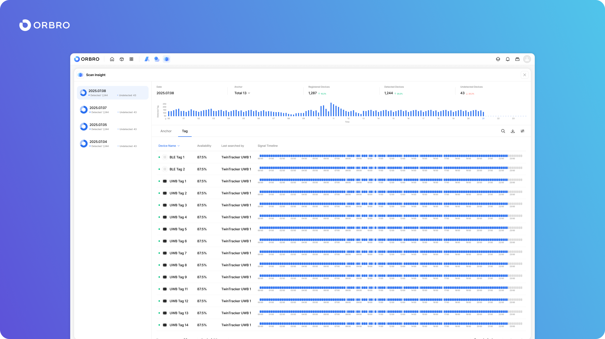
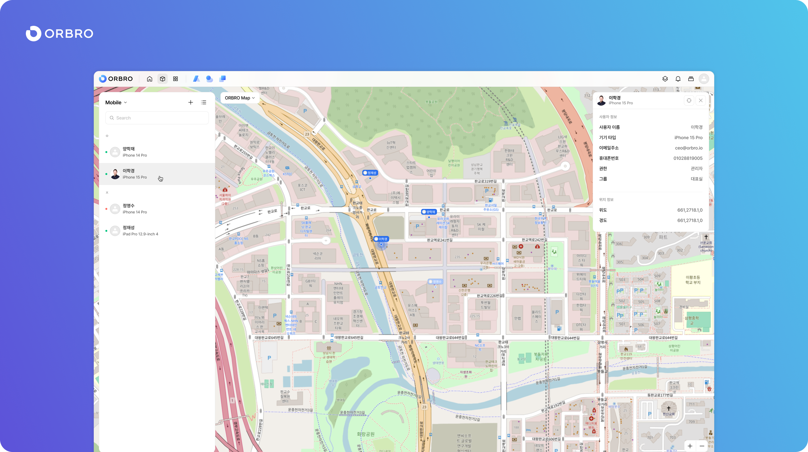

# 릴리즈 노트

## 2.15.0(2025.11.28)

#### Overview

ORBRO OS 2.15.0은 Signal Tower 기기 연동, 카메라 영상 재생 방식 개선, Anchor 관리 화면 개편, AI Event–Signal Tower 연동, LPR 위젯 추가를 중심으로 업데이트되었습니다. AI 이벤트나 주차 현황, 지도·기기 상태를 한눈에 파악하고, 실제 운영 현장에서 사용하는 장치들을 더 안정적이고 직관적으로 관리할 수 있도록 기능과 인터페이스를 함께 다듬은 버전입니다.

#### New Feature

* Device Manager 애플리케이션의 IoT 카테고리에 Signal Tower 기기를 등록할 수 있는 기능이 추가되었습니다. 새로운 Signal Tower 타입을 선택한 뒤 Device Name과 IP Address를 입력하여 장치를 등록할 수 있으며, 등록된 Signal Tower는 이후 AI Event 등과 연동해 시각·음성 알림 장치로 활용할 수 있습니다.

#### User Interface Updates

* ORBRO OS의 Camera 카테고리 기기들은 봉화군 프로젝트에서 검증된 방식에 맞춰 영상 재생 방식이 개선되었습니다. HLS(Video Streaming) 방식이 적용되어 지연 시간이 줄어들고 재생 안정성이 향상되었으며, 영상 로딩 상태를 ‘로딩 중’과 ‘오프라인’으로 구분해 표시해 카메라 상태를 보다 명확히 확인할 수 있습니다.
* Device Manager의 Anchor 카테고리는 실제 운영 환경에 맞춰 UI가 개편되었습니다. 기기 추가 항목에 ‘Anchor’가 명시적으로 제공되며, Anchor 추가 팝업에서는 등록 가능한 Anchor 리스트를 기반으로 선택해 등록할 수 있습니다. Anchor Device 리스트에는 Device Name, Status, Device Type, MAC Address, Server IP, Device IP, Location, Uptime 정보가 함께 표시되어, 시스템 구성과 상태를 한 화면에서 확인할 수 있습니다.
* AI Event 애플리케이션에서는 Signal Tower 기기 연동 설정이 추가되었습니다. 이벤트 추가 팝업의 기기 연동 항목에서 Signal Tower를 복수 선택할 수 있으며, 각 이벤트별로 색상, 점멸 패턴, 사운드(부저 패턴 또는 TTS 방송), 동작 시간을 설정해 이벤트 발생 시 Signal Tower가 동시에 동작하도록 구성할 수 있습니다.
* LPR 위젯을 통해 오늘 현재 주차 중인 차량 대수를 한눈에 확인할 수 있으며, 주차 중인 차량 리스트도 함께 표시됩니다. 이를 통해 주차장 운영 현황을 대시보드에서 빠르게 파악할 수 있습니다.

#### Bug Fix

* AI Event의 이벤트 상세보기 팝업에서 영상이 표시되지 않던 문제가 수정되었습니다.
* Camera Device에 마우스를 올렸을 때 MAC Address 대신 IP Address가 표시되던 문제가 수정되었습니다.
* TwinTracker에 마우스를 올렸을 때 Serial Number 대신 MAC Address가 표시되도록 라벨 표기가 수정되었습니다.
* Demo Camera에 마우스를 올렸을 때 MAC Address 정보가 잘못 표시되던 문제가 수정되었습니다.
* Indoor Map에서 ORBRO Map으로 이동할 때 축척이 정상적으로 동작하지 않던 문제가 수정되었고, 지도에 +/- 버튼이 함께 표시되도록 개선되었습니다.
* 날씨 위젯에 다국어 지원이 적용되지 않던 문제가 수정되었습니다.
* 2.14.0 버전에 포함되었어야 하는 카메라 오브젝트 신규 디자인이 적용되지 않던 문제가 수정되었습니다.
* Camera Device의 Full Size 영상 팝업이 열린 상태에서 다른 카메라를 선택해도 기존 카메라 영상이 유지되던 문제가 수정되었으며, 이제 선택한 카메라의 영상으로 변경되어 표시됩니다.

***

## 2.14.0(2025.11.21)

#### Overview

이번 버전에서는 Horn Speaker 연동을 통한 AI 이벤트 음성 방송, 새로운 Record App 출시, 즐겨찾기 기능, Timeline Application 등을 중심으로 기능이 확장되었습니다. 많은 기기를 사용하는 현장에서 자주 확인해야 하는 장치를 더 쉽게 찾아볼 수 있고, UWB·BLE Tag의 과거 이동 이력을 타임라인으로 확인할 수 있어 운영 및 검증 작업이 한층 수월해집니다.

또한 AI Event, Device 상세 페이지, Zone Manager, Access 애플리케이션의 인터페이스를 함께 개편하여, 방송 설정, 장치 정보 확인, 존 색상 관리, 출입 현황 조회 등 주요 기능을 보다 직관적으로 사용할 수 있도록 개선했습니다. 일부 화면에서의 전체화면 및 오류 페이지 문제도 함께 수정하여 안정성을 높였습니다.

#### New Feature

* Device Manager 애플리케이션에 IoT 카테고리가 추가되어 Horn Speaker를 디바이스로 등록·관리할 수 있습니다. Horn Speaker는 이름과 IP 주소를 기반으로 등록하며, 이후 AI Event와 연동하여 이벤트 발생 시 음성 방송에 활용할 수 있습니다.
* ORBRO Device에 Horn Speaker 전용 상세 정보 페이지가 새로 추가되었습니다. 이 페이지에서는 Horn Speaker의 이름, 유형, IP 주소, 설명, 상태, 위치 등의 정보를 한 화면에서 확인할 수 있으며, 설정 버튼을 통해 이름, IP 주소, 설명, 위치 정보를 수정할 수 있습니다.
* Record App이 신규 출시되었습니다. 기존 대시보드에 포함되어 있던 Record 기능을 독립 앱으로 분리하여 제공하며, 위젯을 통해 현재 녹화 현황을 한눈에 볼 수 있습니다. 녹화는 최대 12시간까지 지원되며, 동시에 한 개의 녹화만 진행할 수 있도록 설계되어 안정적인 녹화 운영이 가능해졌습니다.
* 즐겨찾기 기능이 새롭게 제공됩니다. 계정별로 관리되며, 기기 상세보기 팝업에서 \[즐겨찾기] 버튼을 눌러 자주 확인하는 기기를 등록할 수 있습니다. 즐겨찾기 등록 시 토스트 메시지로 안내가 표시되며, 즐겨찾기 리스트는 기존 1.X.X 버전의 Device 메뉴와 유사한 형태로 제공됩니다. 리스트는 카테고리 이름 순, 기기 이름 순으로 정렬할 수 있고, 전체/현재 공간 기준으로 필터링하여 필요한 기기만 빠르게 확인할 수 있습니다.
* Timeline Application이 새로 출시되었습니다. Zone 데이터를 기반으로 UWB Tag와 BLE Tag(Nearby Search 모드)의 위치 이력을 추출하여, Tag가 과거에 어떤 존에 언제 진입했는지 타임라인 형태로 조회할 수 있습니다. UWB Tag는 존 단위의 위치 기록을, BLE Tag는 TwinTracker 좌표를 기반으로 존 진입 이력을 저장해 보여주며, Device Name, MAC Address, Mode와 함께 일별 타임라인을 확인할 수 있습니다.

#### User Interface Updates

* AI Event 애플리케이션에는 오늘의 AI Event 발생 현황을 한눈에 볼 수 있는 위젯이 추가되었습니다. 각 이벤트 유형별로 알림 메시지를 설정할 수 있으며, 이벤트 발생 시 해당 메시지를 Horn Speaker를 통해 자동 방송하도록 설정할 수 있습니다. 여러 개의 Horn Speaker를 동시에 선택해 방송 대상으로 지정할 수 있고, Horn Speaker에서는 설정된 알림 메시지가 TTS 방식으로 재생됩니다.
* Device 상세 페이지는 즐겨찾기 기능 도입에 맞춰 전반적인 인터페이스가 개편되었습니다. Title Bar 사이즈가 조정되고, 상단 헤더 영역에는 Device 이미지, 상태, Device Name, MAC Address가 함께 표시됩니다. 설명(Description)이 입력된 경우에는 설명을 우선적으로 보여주어, 주요 정보를 한 번에 확인할 수 있습니다.
* Zone Manager 애플리케이션에서는 Timeline 앱과의 연동을 고려하여 Zone 색상 설정 기능이 복구되었습니다. Zone 정보 팝업에서 각 존의 Color 값을 다시 설정할 수 있으며, Zone 리스트에서도 아이콘뿐 아니라 존 색상이 적용된 미리보기가 함께 표시되어, 존별 색상을 직관적으로 구분할 수 있습니다.
* Access 애플리케이션에는 새로운 ‘출입 현황’ 메뉴가 추가되었습니다. 이 메뉴를 통해 현재 출입 상태를 한눈에 확인할 수 있어, 기존 출입 기록 중심의 조회 방식과 함께 운영 상황을 보다 쉽게 파악할 수 있습니다.

#### Bug Fix

* Camera Device 전체 화면 활성화 시 뒤 배경의 애플리케이션을 선택할 수 없던 문제가 수정되었습니다.
* Setting 애플리케이션에서 ‘알림’ 메뉴 클릭 시 화면 500 오류가 발생하던 문제가 수정되었습니다.

***

## 2.13.0(2025.11.14)

#### Overview

ORBRO OS 2.13.0은 영상 모니터링, SOP 운영, 존 관리, 지도 기반 모니터링 경험을 전반적으로 다듬은 업데이트입니다. Multi Cam과 AI RTLS에서는 카메라를 더 직관적으로 선택하고 확인할 수 있도록 인터페이스가 개선되었고, SOP와 Zone Effect에서는 기준 조건 선택과 시나리오 진행 흐름을 정리하여 실제 운영 환경에서 사용성이 향상되었습니다.

또한 Zone Manager, Task Bar, 조건 설정, ORBRO Map, Scan Insight 및 Nearby Search 등 여러 애플리케이션의 UI를 통일감 있게 정리하고, 많은 데이터를 다루는 화면에 무한 스크롤과 클러스터링을 도입하여 성능과 가독성을 함께 고려한 사용 경험을 제공하도록 개선했습니다.

#### User Interface Updates

* Multi Cam 애플리케이션은 기기 보기 필터가 추가되어, 전체 기기 또는 온라인 상태의 기기만 선택하여 볼 수 있습니다. 카메라 리스트에서 항목 영역을 클릭하면 우측에 카메라 상세 패널이 함께 표시되어, 다수의 카메라를 모니터링하면서도 특정 카메라의 상세 정보를 빠르게 확인할 수 있습니다.
* SOP 애플리케이션의 카메라 확인 시나리오 추가 UI가 개선되어, 카메라를 추가하는 전용 버튼을 통해 직관적으로 카메라를 선택할 수 있습니다. 시나리오 진행 시에는 확인 버튼(→)을 클릭하면 우측에 선택된 카메라 화면이 표시됨과 동시에 해당 단계의 체크박스가 자동으로 선택되도록 하여, 시나리오 진행 상태를 자연스럽게 따라갈 수 있습니다. 기준 조건 선택 드롭다운은 조건 이름과 함께 설명 및 등급 정보까지 함께 표시되어, 조건의 의미를 쉽게 이해하고 선택할 수 있으며, SOP 조회 기본 기간은 당일 기준으로 변경되어 최근 상황 중심의 모니터링에 적합한 기본값을 제공합니다.
* Zone Effect 애플리케이션의 이펙트 추가 및 상세 설정 팝업에서는 기준 조건 선택 드롭다운이 SOP와 동일한 형태로 개편되었습니다. 조건 이름뿐 아니라 설명과 등급 정보가 함께 노출되어, 여러 조건을 비교하며 적절한 기준을 선택하기가 한층 수월해졌습니다.
* Zone Manager 애플리케이션에서는 편집 중인 Zone 리스트에서 이름을 직접 수정하거나 삭제할 수 있는 버튼이 추가되었습니다. Edit 버튼을 클릭하면 팝업 편집창을 통해 존 이름 변경 및 삭제 작업을 한 곳에서 처리할 수 있어, 존 구조를 관리하는 작업 흐름이 단순해졌습니다.
* Task Bar 인터페이스는 앱 아이콘 위에 마우스를 올리면 앱 이름이 툴팁으로 표시되도록 개선되어, 아이콘만 보고도 어떤 애플리케이션인지 쉽게 파악할 수 있습니다. 또한 기존의 Border 대신 Shadow를 활용해 선택 상태를 표현함으로써, 전체 인터페이스와 보다 자연스럽게 어우러지는 시각적 스타일을 제공합니다.
* 설정의 조건 관리 화면에서는 조건 영역에 필터 버튼이 추가되어, 조건을 정렬하는 방식을 선택할 수 있습니다. 필터 버튼을 클릭하면 정렬 기준을 선택하는 옵션이 표시되며, 기본값은 이름 순으로 제공되어 많은 조건을 보다 체계적으로 관리할 수 있습니다.
* ORBRO Map에는 지도 축척 표시가 추가되어, 지도 상에서 보이는 거리와 범위를 보다 직관적으로 파악할 수 있습니다. 이를 통해 기기나 존의 위치 관계를 거리 감각과 함께 이해할 수 있어, 지도 기반 모니터링이 한층 수월해집니다.
* ORBRO Map에서는 기기들을 클러스터링 형태로 표시하는 기능이 도입되었습니다. 일정 축척 이상으로 축소했을 때는 여러 기기가 클러스터로 묶여 표시되어 지도가 복잡해지지 않으며, 지도를 확대하면 기존처럼 각 기기가 개별 아이콘으로 표시됩니다. 또한 지도 최초 진입 시 줌 레벨은 GPS 단말기 및 모바일 기기가 최대한 잘 보이는 뷰를 기준으로 설정되어, 위치 추적용 단말기를 중심으로 화면을 확인할 수 있습니다.
* Scan Insight 및 Nearby Search 애플리케이션의 기록 리스트에는 무한 스크롤 방식이 적용되었습니다. 많은 데이터가 저장된 경우에도 페이지 이동 없이 스크롤만으로 기록을 연속해서 확인할 수 있어, 대량 데이터 환경에서의 성능과 사용성을 함께 고려한 조회 경험을 제공합니다.
* AI RTLS 애플리케이션에서는 카메라 썸네일을 클릭하면 우측에 해당 카메라의 기기 팝업이 표시되도록 개선되었습니다. 사용자는 실시간 위치 정보와 함께 연동된 카메라 화면 및 기기 정보를 빠르게 확인할 수 있어, 현장 상황 파악과 분석이 더욱 편리해집니다.
* 보기 설정에서는 모바일과 GPS Device를 위한 보기 필터가 추가되고, Device Manager의 Device Type 순서에 맞춰 필터 순서가 정리되었습니다. 이를 통해 특정 타입의 기기만 선택적으로 표시하거나 숨길 수 있어, 화면을 용도에 맞게 간결하게 구성할 수 있습니다.
* 카메라 영상의 Full Screen 버튼을 클릭하면 기존의 동일 화면 내 전체 화면 전환 방식 대신, 팝업 형식으로 영상을 크게 띄워 확인할 수 있습니다. 이를 통해 전체 레이아웃은 유지하면서도 필요한 카메라 영상만 크게 확대해 모니터링할 수 있습니다.

#### Bug Fix

* Zone Manager에서 Zone 삭제 툴로 존을 삭제했을 때 \[저장] 버튼이 활성화되지 않던 문제가 수정되었습니다.
* Zone Manager에서 Zone 이름 수정 후 \[확인] 버튼 클릭 시 창이 닫히지 않던 문제가 수정되었습니다.
* LPR 애플리케이션 ‘기록’ 메뉴에서 카메라를 클릭해도 우측에 카메라가 표시되지 않던 문제가 수정되었습니다.
* SOP 발생 시 애플리케이션 팝업이 호출되지 않고 알림만 표시되던 문제가 수정되었습니다.
* SOP 상태 및 담당자 컬럼의 정렬 기능이 동작하지 않던 문제가 수정되었습니다.

***

## 2.12.0(2025.11.07)

#### Overview

ORBRO OS 2.12.0은 출입 기록 조회 경험과 장치 관리 화면, 데이터 시각화, SOP 운영 흐름을 중심으로 사용자 경험을 다듬은 버전입니다. Access 애플리케이션에서는 그동안 엑셀 다운로드에 의존하던 출입 기록을 이제 화면에서 직접 조회할 수 있어, 출입 이력을 더 빠르게 확인할 수 있습니다.

또한 Device Manager, Scan Insight, AI Event, SOP, 지도 등의 인터페이스를 통일감 있게 정리하여, 여러 애플리케이션을 오가면서도 자연스럽고 예측 가능한 동작을 경험할 수 있도록 개선했습니다. SOP 위젯과 미리보기, 팝업 위치, RoI 표시 방식 등을 함께 다듬어 실제 운영 환경에서의 편의성과 시인성을 높였습니다.

#### User Interface Updates

* Access 애플리케이션에는 출입 기록을 직접 조회할 수 있는 화면이 추가되었습니다. 사용자는 원하는 기간과 조건을 선택해 출입 이력을 바로 확인할 수 있으며, 필요할 경우 기존처럼 엑셀 파일로도 다운로드할 수 있습니다. 상단 메뉴에는 ‘출입 기록’이 새로 추가되고, 사용자 관리·정책 관리·E/L 관리 등 설정 성격의 메뉴는 ‘설정’ 아래로 모아, 운영 메뉴와 설정 메뉴가 한눈에 구분되도록 정리되었습니다.
* Device Manager 애플리케이션은 장치 카테고리 구조와 기기 추가 흐름이 재구성되었습니다. 장치 유형별 카테고리가 실제 사용 흐름에 맞게 재배치되고, 기기 추가 시에는 먼저 장치 타입을 선택한 뒤 세부 정보를 입력하는 방식으로 보다 이해하기 쉬운 단계 구성을 제공합니다. 등록된 기기가 없는 카테고리는 자동으로 숨겨져, 실제로 사용 중인 장치만 깔끔하게 확인할 수 있습니다.
* Scan Insight 애플리케이션은 송신 주기와 데이터 수집 상태 표시 방식이 개선되었습니다. 송신 주기가 매우 긴 경우에는 초(sec) 단위로 변환해 보여주어 값을 직관적으로 이해할 수 있고, 데이터가 수집 중인 구간은 숫자 대신 진행 상태를 확인할 수 있는 로딩 표시로 나타나, 그래프만 보더라도 현재 상태를 쉽게 파악할 수 있습니다. 송신 주기를 측정할 수 없는 경우에는 ‘측정 불가’로 명확히 표기되어 상태를 오해하지 않도록 했습니다.
* ORBRO OS 전반에서 우측 패널의 동작은 ESC 키로 빠르게 닫을 수 있도록 통일되었습니다. 사용자는 마우스 커서를 이동하지 않고도 키보드만으로 패널을 닫을 수 있어, 여러 화면에서 동일한 방식으로 빠르게 작업을 마무리할 수 있습니다.
* 앱 실행 시 표시되는 팝업의 위치는 화면 중앙 부근에서 자연스럽게 노출되도록 조정되었습니다. 이전처럼 화면 모서리 쪽에 예상치 못한 위치로 나타나는 경우를 줄여, 팝업을 더 쉽게 인지하고 대응할 수 있습니다.
* AI Event 애플리케이션에서는 이벤트 기록에서 카메라를 선택하면 우측 영역에서 해당 카메라의 화면을 함께 확인할 수 있습니다. 이를 통해 이벤트 목록과 실제 영상 상황을 동시에 보면서, 이상 상황을 보다 빠르고 직관적으로 파악할 수 있습니다.
* SOP 시나리오 추가 팝업의 미리보기 화면은 일부 항목이 아직 설정되지 않았더라도 레이아웃이 깨지지 않고 안정적으로 표시되도록 개선되었습니다. 입력되지 않은 항목은 미리보기에서 플레이스홀더 텍스트로 표시되어, 어떤 값이 비어 있는지 자연스럽게 확인할 수 있습니다.
* Tag 단말기 Nearby Search와 Scan Insight에서는 그래프, 임계치, 데이터가 같은 순서로 표시되도록 인터페이스가 정리되었습니다. 여러 화면에서 동일한 순서와 구조로 정보를 확인할 수 있어, 데이터를 읽고 비교하는 과정이 더 자연스러워졌습니다.
* SOP 위젯은 미완료된 SOP를 한눈에 확인할 수 있는 형태로 다시 제공됩니다. 대시보드에서 진행 중인 작업을 즉시 확인하고 후속 조치를 이어갈 수 있어, SOP 운영 상황을 보다 효율적으로 관리할 수 있습니다.
* 지도 내 RoI(관심 영역) 표시 방식은 AI RTLS와 동일한 그라디언트 스타일로 변경되었습니다. 이를 통해 지도 기반 화면 전반에서 관심 영역이 시각적으로 통일된 형태로 강조되며, 여러 애플리케이션을 사용할 때도 동일한 표현 방식을 경험할 수 있습니다.

#### Bug Fix

* Scan Insight 애플리케이션에서 송신 주기 정렬 기능이 동작하지 않던 문제가 수정되었습니다.
* Zone Counting에서 존에 마우스를 올렸을 때 카테고리별 숫자 표시가 디자인과 다르게 보이던 문제가 수정되었습니다.
* Zone 모니터링 탭에서 아이콘 색상이 실제 설정한 색상과 다르게 표시되던 문제가 수정되었습니다.
* AI Event 애플리케이션 기록 화면에서 ‘이벤트 유형’ 정렬 기능이 동작하지 않던 문제가 수정되었습니다.
* AI Event 기록 화면에서 이미지의 모서리 둥글기(radius)가 적용되지 않던 문제가 수정되었습니다.

***

## 2.11.0(2025.10.31)

#### Overview

ORBRO OS 2.11.0은 Demo Camera 기능 추가, AI Event 및 LPR 애플리케이션의 삭제 기능 지원, SOP 기록 관리 개편, 그리고 위젯 및 작업 표시줄의 사용자 인터페이스 개선을 중심으로 업데이트되었습니다.

이번 버전에서는 실제 장비 연결 없이도 영상 기반 AI 기능을 테스트할 수 있도록 Demo Camera 타입이 새롭게 추가되었으며, 이를 통해 개발 및 데모 환경에서 보다 유연한 테스트가 가능합니다. 또한 Zone Counting의 실시간 현황을 빠르게 파악할 수 있는 Zone Counting 위젯이 새롭게 제공되어, 주요 지표를 한눈에 확인할 수 있습니다.

AI Event, AI LPR, SOP 등 이벤트 기반 애플리케이션에는 이전 기록 삭제 기능이 추가되어 불필요한 데이터를 정리하고 테스트 환경을 효율적으로 관리할 수 있게 되었으며, Launch Pad와 작업 표시줄은 사용자 계정별 커스터마이징 기능이 강화되어 더욱 유연한 화면 구성이 가능합니다.

#### New Feature

* Device Manager의 Camera 항목에 Demo Camera가 새롭게 추가되어, 실제 장비 연결 없이도 영상 파일을 업로드하여 애플리케이션을 실행할 수 있습니다. 사용자는 기기 등록 시 ‘Demo Camera’ 타입을 선택하고 카메라 이름, 설명, 영상 파일을 직접 업로드할 수 있으며, 등록된 기기 리스트에서는 IP 주소 대신 ORBRO OS 서버 주소가 표시됩니다. Demo Camera는 멀티캠 환경에서 최대 12개 화면까지 동시 확인이 가능합니다.
* Device 항목 내에서도 Demo Camera가 정식 지원되어, 기존 카메라와 동일한 방식으로 표시되지만 연결 설정 항목이 제거되고 대신 영상 파일 업로드 영역이 제공됩니다. 이를 통해 실제 네트워크 연결 없이도 AI 기반 테스트 및 시연이 가능해졌습니다.
* Zone Counting 애플리케이션에는 실시간 현황을 표시하는 위젯 기능이 추가되어, 각 Zone의 상태를 빠르게 파악할 수 있습니다. 위젯 내 표시 순서는 Zone Counting 설정에서 지정한 숫자 편집 순서를 기반으로 자동 정렬됩니다.

#### User Interface Updates

* AI Event 애플리케이션은 사용자 요청이 많았던 이벤트 삭제 기능과 영상 기반 조회 기능이 새롭게 추가되었습니다. 이벤트 조회는 1일 단위로 제한되어 관리 효율이 높아졌으며, 리스트에서 항목 앞의 체크박스를 선택하면 삭제 버튼이 활성화되어 원하는 기록만 제거할 수 있습니다. 상세 팝업의 이미지 영역은 영상으로 변경되어, 마우스 Hover 시 재생·정지·전체 화면·다운로드 등의 Video Player Tool Bar가 표시됩니다. 또한 이벤트 리스트에서 카메라를 클릭하면 우측에 해당 카메라 영상이 함께 표시됩니다.
* AI LPR 애플리케이션 역시 이벤트 삭제 기능이 동일하게 추가되어 리스트에서 선택 삭제가 가능하며, 상세 팝업 하단에는 개별 기록 삭제 버튼이 새롭게 제공됩니다.
* SOP 애플리케이션은 테스트 및 데모 중 발생하는 기록을 손쉽게 관리할 수 있도록 개선되었습니다. SOP 기록 리스트에는 체크박스가 추가되어 선택 시 ‘삭제’ 버튼이 활성화되며, SOP 상세 보기 화면에서도 언제나 삭제 버튼이 표시되어 신속한 데이터 관리가 가능합니다.
* Heatmap 애플리케이션의 조회 단위는 일 단위로 단일화되어, 데이터 조회 속도와 안정성이 향상되었습니다.
* 조건 추가 화면에서는 연결된 Device나 Zone이 존재하지 않을 경우 항목이 자동으로 비활성화(Disabled)되어, 불필요한 오류 입력을 방지합니다.
* Launch Pad에서는 앱 아이콘 순서 변경 및 고정 기능이 추가되었습니다. 사용자는 마우스 드래그 앤 드롭으로 앱의 순서를 자유롭게 변경할 수 있으며, 마우스 우클릭 메뉴를 통해 선택한 앱을 작업 표시줄에 고정하거나 숨길 수 있습니다.
* 작업 표시줄 또한 사용자 계정별 고정 및 순서 변경 기능을 지원합니다. 앱을 드래그 앤 드롭하여 순서를 변경할 수 있고, 우클릭으로 고정 해제가 가능합니다.
* 위젯 기능은 사이즈 확대·축소가 가능해졌으며, 다양한 위젯이 늘어남에 따라 Dashboard 형태의 인터페이스로 확장되었습니다. 위젯을 확대하면 전체 화면(Full Size)으로 전환되며, 3단 구조로 구성되어 더욱 유연한 데이터 시각화를 제공합니다.

#### Bug Fix

* Nearby Search의 엑셀 다운로드 기능이 정상적으로 동작하지 않던 문제가 해결되었습니다.
* Tag 단말기의 Nearby Search 항목 상단 간격이 디자인 기준과 일치하도록 수정되었으며, 태그 단말기 선택 시 기본 모드가 자동으로 선택되도록 개선되었습니다.
* ZoneEffect가 설정된 Zone을 Zone Manager에서 수정할 때 변경사항이 지도에 반영되지 않던 오류가 수정되었으며, AI Event 애플리케이션의 엑셀 다운로드 시 데이터가 표시되지 않던 문제가 해결되었습니다.

***

## 2.10.0(2025.10.24)

#### Overview

ORBRO OS 2.10.0은 ORBRO Tag 연동, Zone 기반 애플리케이션 편의성 강화, Launch Pad 및 Combo Box 인터페이스 개선을 중심으로 업데이트되었습니다.

이번 버전에서는 신규 하드웨어인 ORBRO Tag가 OS 내에 정식 연동되어, Tag 단말기의 상세 정보를 직접 확인할 수 있게 되었으며, Zone Counting / In-out Tracking / Reverse Tracking / Zone Manager 등의 주요 애플리케이션에서는 Edit 버튼과 중간 기준선(0선) 추가를 통해 더욱 직관적인 인터랙션이 가능해졌습니다.

또한 Launch Pad의 검색 경험이 개선되고, Combo Box UI가 다수의 애플리케이션에 적용되어 복잡한 리스트 내에서도 원하는 항목을 빠르게 선택할 수 있습니다.

#### New Feature

* 신규 ORBRO Tag 기기 연동이 추가되어, Tag 단말기 등록 시 Device Type에 ‘ORBRO Tag’가 표시되고 기기 상세 정보에서 Name, Category, MAC Address, Signal, Battery, Uptime 등 주요 데이터를 확인할 수 있습니다.

#### User Interface Updates

* Alarm 리스트에서는 스크롤 시 날짜가 상단에 고정되어 알림 구분이 더욱 명확해졌습니다.
* Zone Counting 애플리케이션은 Zone 상세 팝업 내 Edit 버튼이 추가되어 바로 수정이 가능해졌으며, 그래프에는 Current(현재)와 Total(총계) 항목이 함께 표시됩니다. 하단의 Total 항목은 Detected(감지됨)으로 라벨이 변경되어 범례용으로만 표시됩니다.
* In-out Tracking 애플리케이션은 Zone 상세 팝업에 Edit 버튼이 추가되어 손쉽게 수정할 수 있고, 그래프 중앙에는 기준선(0)이 추가되어 데이터가 없는 경우에도 구분이 명확합니다.
* Reverse Tracking 애플리케이션은 Zone 상세 팝업 내 Edit 버튼이 추가되고, 그래프 하단의 Reverse Tracking 항목명이 Total Reverse로 변경되었습니다.
* Zone Manager 애플리케이션은 Zone 상세 팝업에서 Edit 버튼을 통해 직접 수정이 가능하며, 팝업창이 Zone의 중심 위치에 표시되도록 개선되었습니다.
* 다양한 애플리케이션의 선택 항목에는 검색형 Combo Box 컴포넌트가 적용되어, Zone, Device, 조건 등 복잡한 리스트 내에서도 원하는 항목을 빠르게 검색하고 선택할 수 있습니다.
* TwinTracker Laser 기기의 시각적 구분을 위해 전용 이미지가 추가되었으며, 2.9.0 버전에서 누락되었던 Nearby Search Timeline Graph가 완성되어 Tag 상세 페이지와 애플리케이션 내에서 Timeline 및 Confidence 데이터를 확인할 수 있습니다.
* Launch Pad는 실행 시 자동으로 검색창에 포커스가 맞춰지고, 닫힐 때 입력값이 초기화되도록 개선되어 검색 효율이 높아졌습니다.
* Device Manager의 상태 정렬 순서는 Online → Sleep Mode → No Signal → Offline → None(영업요청) 순서로 변경되어 가시성이 향상되었습니다.
* 모든 팝업과 상세 창에서 ESC 키를 누르면 즉시 창이 닫히도록 개선되었으며, Zone Effect 애플리케이션에서도 Edit 버튼이 추가되어 직접 수정이 가능합니다.

#### Bug Fix

* Launch Pad의 앱 순서가 Figma 기준(기본앱: 회색, 기타앱: 파란색)으로 정렬되도록 수정되었습니다.
* UWB Tag Danger 알림에서 표시되지 않던 Device Icon과 Title이 정상적으로 표시되며, Zone 모니터링 탭의 색상도 카테고리 설정값에 맞게 표시되도록 수정되었습니다.
* TwinTracker Data 그래프는 Laser 기기에서만 표시되도록 제한되었고, ORBRO Map은 회색 영역을 넘어 이동이 불가능하도록 변경되었습니다.
* Scan Insight 그래프의 선 두께가 Figma 기준으로 조정되었으며, 마우스 호버 시 선을 따라 점이 표시되는 인터랙션이 추가되었습니다.
* AI 객체 인식에서 차량이 사람으로 잘못 인식되던 문제가 개선되어 인식 정확도가 향상되었습니다.

***

## 2.9.0(2025.10.17)

#### Overview

ORBRO OS 2.9.0은 SOP(Application) 신설, Object 색상 커스터마이징 기능, Nearby Search 알고리즘 고도화, Scan Insight 인터페이스 개편을 중심으로 업데이트되었습니다.

이번 버전에서는 기존 Dashboard에 종속되어 있던 SOP 기능이 독립 애플리케이션으로 분리되어, 시나리오 기반의 표준 운영 절차(SOP)를 손쉽게 설정하고, 기록 및 보고서 기능을 통해 운영 이력을 효율적으로 관리할 수 있습니다.

또한 Object 카테고리 설정 기능이 확장되어, 사용자가 오브젝트별 색상을 직접 지정할 수 있게 되었으며, 이를 통해 동일한 유형의 객체 간 시각적 구분이 용이해졌습니다. Nearby Search 애플리케이션은 알고리즘 및 UI가 개선되어 BLE Tag 중심의 정밀 탐색 기능을 강화하였고, Scan Insight는 그래프 형태를 Line Graph로 개편하여 가독성을 높였습니다.

#### New Feature

* SOP 애플리케이션은 기존 Dashboard에 포함되어 있던 SOP 기능을 독립 애플리케이션 형태로 제공하며, 시나리오(구 시퀀스) 생성 시 이동 경로 설정이 제거되고 미리보기 기능이 추가되었습니다. 사용자는 SOP 발생 이력을 발생시간, 이름, 상태, 종료시간, 위치, 담당자 기준으로 확인할 수 있으며, 조회기간, 상태, SOP 종류별 필터를 통해 데이터를 세분화할 수 있습니다. 또한 SOP 기록 조회 시 보고서 다운로드 및 삭제 기능이 제공되고, 설정 메뉴에서는 SOP 이름별 리스트 확인 및 신규 SOP 추가가 가능합니다.

#### User Interface Updates

* Object 색상 변경 기능이 추가되어 사용자가 오브젝트 카테고리 설정에서 색상을 직접 지정할 수 있습니다. 오브젝트 추가 및 상세 팝업 내 색상 설정 항목이 새롭게 제공되며, Tag 오브젝트의 경우 아이콘, 이름, 색상 변경이 가능하고 Device(기본) 카테고리는 수정이 제한됩니다. AI 오브젝트 또한 색상 변경이 가능하여 객체별 시각적 구분이 용이해졌습니다.
* Nearby Search 애플리케이션은 BLE 중심으로 재구성되어 UWB Tag 단말기가 표시되지 않으며, 리스트는 Device Name, Mode(Default/Nearby Search), Nearby Search Result, Confidence, Timeline 순으로 표시됩니다. 필터 기능이 추가되어 기기 타입(BLE Tag)과 Mode(Default/Nearby Search)별로 조회할 수 있으며, 각 단말기별 체크박스를 통해 모드를 전환할 수 있습니다. Default 모드는 기존 알고리즘을, Nearby Search 모드는 신규 알고리즘을 기반으로 동작합니다.
* Tag 단말기 상세 보기화면에는 Nearby Search 항목이 새롭게 추가되어 Mode와 Search Result 정보를 확인할 수 있으며, UWB Tag 단말기는 제외됩니다.
* Scan Insight 애플리케이션은 그래프 형태가 Bar Graph에서 Line Graph로 변경되어 데이터 흐름이 더욱 직관적으로 표시되며, 동일한 데이터 구조를 유지합니다. 이와 함께 TwinTracker Series의 Scan Insight Section 또한 UI가 개편되어 전체적인 그래프 시각화 체계를 통일했습니다.

#### Bug Fix

* Zone 이름이 긴 경우 발생하던 레이아웃 깨짐 현상이 수정되었습니다.

***

## 2.8.1(2025.09.12)

#### New Feature

* TwinTracker Laser 기기가 새롭게 지원됩니다. 이번 업데이트를 통해 사용자는 기존 TwinTracker BLE와 동일한 구조로 Laser 기반의 거리 데이터를 함께 활용할 수 있습니다. 기기 클릭 시 Scan Insight 및 Nearby Search 애플리케이션 항목이 동일하게 제공되며, Device Data 항목이 추가되어 1분 단위의 평균 데이터를 m(미터) 단위로 표시합니다. 수치는 소수점 둘째 자리까지 표기되어 정밀한 거리 측정 및 모니터링이 가능합니다.

***

## 2.8.0(2025.09.05)

#### Overview

ORBRO OS 2.8.0은 Zone 기능의 고도화, AI 기반 이벤트 탐지 도입, 신규 기기 지원, 그리고 사용자 환경 개선을 중심으로 업데이트되었습니다. 이번 버전에서는 기존 Dashboard에 포함되어 있던 Zone Insight, In-out Tracking, Reverse Tracking 기능이 각각 독립 애플리케이션으로 분리되어 제공됩니다. 이를 통해 사용자는 Zone 단위 데이터를 더욱 직관적으로 설정하고 관리할 수 있으며, 각 애플리케이션에서 제공하는 그래프, 기록, 다운로드 기능을 활용해 운영 환경에 맞는 맞춤형 분석을 수행할 수 있습니다.

<figure><figcaption></figcaption></figure> <figure><figcaption></figcaption></figure> <figure><figcaption></figcaption></figure>

신규로 추가된 AI Event 애플리케이션은 카메라 단위의 이벤트 감지와 기록을 지원합니다. 사용자는 감지할 이벤트를 카메라별로 지정할 수 있으며, 조회 메뉴에서는 이벤트 유형이나 카메라별 필터링, 상세 팝업 확인을 통해 필요한 데이터에 빠르게 접근할 수 있습니다. 이를 통해 보안, 안전 관리, 시설 운영 전반에서 AI 기반 상황 인식 기능을 적극적으로 활용할 수 있습니다.

<figure><figcaption></figcaption></figure> <figure><figcaption></figcaption></figure>

하드웨어 영역에서는 TwinTracker Laser 기기가 지원되면서 기존 BLE 기기와 동일한 구조를 유지하면서도 레이저 기반 거리 데이터 제공이 가능해졌습니다. 기기 화면에서는 Scan Insight 및 Nearby Search 기능을 동일하게 사용할 수 있으며, 1분 단위의 평균 데이터를 m 단위(소수점 둘째 자리까지)로 표시하여 더욱 정밀한 모니터링 환경을 지원합니다. 이에 따라 Setting 애플리케이션도 확장되어, Laser 데이터를 활용한 조건 설정이 가능해지고, AI Event와 Reverse Tracking 알림을 개별적으로 관리할 수 있는 알림 기능이 추가되었습니다.

<figure><figcaption></figcaption></figure> <figure><figcaption></figcaption></figure>

UI 개선도 이루어졌습니다. Zone 인터페이스는 단순 카운팅 숫자가 제거되고, 마우스 Hover 시 해당 Zone과 연결된 애플리케이션 정보를 확인할 수 있으며, Zone 클릭 시 표시되는 세부 항목은 카드형에서 리스트형으로 개편되어 정보 확인이 간결해졌습니다. 또한 Dashboard 애플리케이션은 불필요한 항목이 제거되면서 단순화되었고, Alert Zone은 Zone Counting 기능으로 재편되어 동일한 역할을 수행합니다.

이와 같이 ORBRO OS 2.8.0은 Zone, AI, 기기, UI 전반에서의 개선을 통해 사용자가 데이터를 더욱 직관적이고 효율적으로 다룰 수 있도록 지원하며, 실제 운영 환경에서 안정성과 활용성을 동시에 강화합니다.

#### New Feature

* Zone Counting 애플리케이션은 기존 Zone Insight를 고도화한 형태로 출시되었습니다. Zone 단위로 카운팅을 설정할 수 있으며, 하나의 Zone에 복수의 카운팅을 지정할 수 있습니다. 각 카운팅은 편집, 삭제, 순서 변경이 가능하며, CSV 다운로드 기능을 통해 시간 단위의 카운팅 데이터를 외부로 추출할 수 있습니다.
* In-out Tracking 애플리케이션은 Dashboard 항목에서 독립 애플리케이션으로 제공되며, Zone에 기준선을 설정하여 In/Out을 구분할 수 있습니다. 그래프 메뉴에서는 날짜별 조회, 실시간 업데이트, 다운로드, 순서 편집 및 검색 기능이 제공되며, 기록 메뉴에서는 날짜, 시간, 방향, 객체, 위치별 리스트와 필터 기능이 지원됩니다.
* Reverse Tracking 애플리케이션은 Dashboard에서 분리되어 독립적으로 제공됩니다. 그래프 메뉴에서는 날짜별 조회, 실시간 업데이트, 다운로드, 순서 편집 기능을 지원하고, 기록 메뉴에서는 Reverse Tracking별 상세 리스트와 필터 기능이 제공되어 역추적 데이터를 손쉽게 관리할 수 있습니다.
* AI Event 애플리케이션은 카메라 단위의 이벤트 감지 및 기록을 지원합니다. 기록 메뉴에서는 기간별 조회, 이벤트 유형 및 카메라별 필터링, 상세 팝업 기능이 제공되며, 설정 메뉴에서는 카메라별로 감지할 이벤트 유형을 선택할 수 있어 상황별 맞춤 구성이 가능합니다.
* TwinTracker Laser 기기가 새롭게 지원됩니다. 기존 BLE 기기와 유사한 구조를 가지며, 추가적으로 Laser 기반 거리 데이터를 제공합니다. 기기 화면에서는 Scan Insight 및 Nearby Search 기능을 동일하게 제공하며, Device Data 항목에서 1분 단위 평균값을 m 단위(소수점 둘째 자리까지)로 확인할 수 있습니다.
* Setting 애플리케이션은 알림과 조건 설정 기능이 확장되었습니다. 알림 메뉴에는 AI Event와 Reverse Tracking이 추가되어 개별 알림 설정이 가능하며, 조건 메뉴에는 TwinTracker Laser가 포함되어 소수점 단위의 정밀 데이터를 기반으로 조건을 구성할 수 있습니다.

#### User Interface Updates

* Zone 인터페이스는 기존 숫자 카운팅이 제거되고, 마우스 Hover 시 해당 Zone을 활용하는 애플리케이션 정보를 표시하도록 변경되었습니다. 또한 Zone 클릭 시 표시되는 세부 항목은 카드형에서 리스트형으로 개편되어 정보 확인이 보다 간결해졌습니다.
* Dashboard 애플리케이션은 Alert Zone, Reverse Tracking, In-out Tracking 항목이 제거되었으며, Alert Zone은 Zone Counting 기능을 통해 동일한 역할을 수행할 수 있도록 재구성되었습니다.

***

## 2.7.0(2025.08.27)

#### Overview

이번 ORBRO OS 2.7.0 버전은 애플리케이션 확장을 중심으로 한 대규모 업데이트로, 신규 앱 출시와 기존 앱 개편을 통해 운영 환경에서의 활용성을 한층 강화했습니다.

AI RTLS 애플리케이션은 카메라 기반의 위치추적 기능을 제공하여 공간 단위로 등록된 카메라를 관리할 수 있습니다. 사용자는 카메라별 AI 위치추적을 활성화하거나 ROI를 설정할 수 있으며, 오브젝트 색상과 모델을 직접 지정할 수 있어 유연한 추적 환경을 구축할 수 있습니다.

<figure><figcaption></figcaption></figure>

LPR 애플리케이션은 ORBRO OS에 등록된 카메라를 활용해 차량 번호판을 인식하고, 카메라별·기간별로 기록을 조회할 수 있습니다. 이를 통해 주차 관리, 출입 통제, 보안 관제 등 다양한 영역에서 차량 데이터 활용이 가능해졌습니다.

<figure><figcaption></figcaption></figure>

Scan Insight 애플리케이션은 BLE Traffic Overview 데이터를 기반으로 새롭게 출시되어, 태그와 송신 주기 데이터를 효과적으로 관리할 수 있도록 지원합니다. 기존 Scan Insight는 Nearby Search 애플리케이션으로 개편되어 그래프 디자인과 인터랙션이 개선되었으며, 태그 타임라인 그래프에서 Hover 시 Nearby Search 결과를 직관적으로 확인할 수 있습니다.

<figure><figcaption></figcaption></figure>

또한 Heatmap 애플리케이션은 기존에 데이터 과부하로 동작하지 않던 문제를 해결하기 위해 구조가 최적화되었습니다. 이번 개선으로 대용량 데이터 환경에서도 안정적인 시각화와 분석이 가능해졌습니다.

#### New Feature

* 기존 Scan Insight 애플리케이션은 Nearby Search로 개편되어 Anchor 탭 그래프 디자인이 개선되었고, Tag 타임라인 그래프에서도 마우스 Hover 시 Nearby Search 결과를 확인할 수 있습니다.
* &#x20;BLE Traffic Overview 데이터를 기반으로 한 새로운 Scan Insight 애플리케이션이 출시되어 기존 구조를 보완하였으며, Tag 탭은 기존 Scan Insight와 유사한 형태로 제공됩니다.&#x20;
* AI RTLS 애플리케이션이 새롭게 추가되어 공간 단위로 등록된 카메라를 표시하고, 카메라별로 AI 위치추적을 활성화하거나 비활성화할 수 있습니다. 또한 카메라 매핑과 ROI 설정이 가능하며, 앱 설정을 통해 AI 오브젝트의 색상과 모델을 변경할 수 있습니다.&#x20;
* LPR 애플리케이션은 ORBRO OS에 등록된 카메라를 활용해 차량 번호판 인식 기능을 제공하며, 기간별 및 카메라별로 LPR 기록을 조회할 수 있습니다.&#x20;

#### User Interace Updates

* TwinTracker 기기 정보 영역은 애플리케이션 정보를 표시하는 구조로 변경되어 기존 BLE Traffic Overview는 Scan Insight로, Nearby Search Result는 Nearby Search로 표기됩니다. 이를 통해 기기 정보 화면 내 애플리케이션 구분이 보다 명확해졌습니다.&#x20;
* Tag 기기 정보 영역은 Signal Availability 레이블이 Reception Rate로 변경되었으며, 색상과 폰트 크기 조정이 적용되어 데이터의 가독성이 향상되었습니다. 이로써 사용자는 기기 상태를 더 직관적으로 확인할 수 있습니다.&#x20;
* 카메라 기기의 등록 및 설정 방식은 단순화되어 기존의 복잡한 정보 입력 항목 대신 URL 정보만 표시되도록 개선되었습니다. 이를 통해 카메라 기기 관리 과정이 한층 간결해지고 효율성이 높아졌습니다.&#x20;
* Heatmap 애플리케이션은 백엔드 구조 최적화를 통해 데이터 과부하와 타임아웃 문제를 줄이는 개선이 적용되었습니다. 대용량 데이터 처리 시에도 안정적인 동작을 기대할 수 있습니다.

#### Bug Fix

* Heatmap 애플리케이션에서 발생하던 데이터 과부하로 인한 비정상 동작 문제가 수정되어 원활한 시각화가 가능해졌습니다.&#x20;
* 카메라 등록 및 정보 표시 과정에서 간헐적으로 발생하던 오류가 개선되어 카메라 관리와 설정 과정의 안정성이 향상되었습니다.

***

## 2.6.3(2025.08.29)

#### Overview

이번 2.6.3 버전은 신규 센서 지원을 중심으로 업데이트되었습니다. Air Quality와 Ventax SGD01 센서가 추가되어 환경 모니터링과 안전 관리 기능이 강화되었습니다.

<figure><figcaption></figcaption></figure> <figure><figcaption></figcaption></figure>

#### New Feature

* Air Quality 센서는 배터리 상태값을 External Power, 20%, 50%, 80% 네 가지 단계로 표시할 수 있으며, 알림 설정 기능을 제공합니다.&#x20;
* Ventax SGD01 가스 감지기는 신규로 추가된 센서로, 기기 상세 페이지와 설정 페이지를 통해 상태 확인 및 알림 설정을 지원하여 현장의 안전성을 높일 수 있습니다.

***

## 2.6.2(2025.08.25)

#### Overveiw&#x20;

이번 2.6.2 버전은 신규 애플리케이션 출시와 기존 기능 개선을 포함하는 업데이트입니다. 특히, Multi Cam 애플리케이션이 새롭게 추가되어 여러 카메라 영상을 동시에 모니터링할 수 있으며, 기존 사용자 인터페이스 일부도 안정성을 위해 개선되었습니다.

<figure><figcaption></figcaption></figure>

#### New Feature

* Multi Cam 애플리케이션이 새롭게 출시되어 AI 서버에서 수신한 영상을 다중으로 표시할 수 있습니다. 이를 통해 관리자는 여러 카메라 화면을 동시에 모니터링하며 현장의 상황을 보다 직관적으로 파악할 수 있습니다.

***

## 2.6.1(2025.08.19)

#### User Interface Updates

* 알림 Toast 메시지가 마우스 클릭 시 정상적으로 사라지도록 개선되었습니다.

#### Bug Fix

* Device Manager에서 기기 추가 시 발생하던 오류가 수정되어 기기 등록이 정상적으로 동작합니다.&#x20;
* Zone Effect 애플리케이션에서 효과 추가 시 발생하던 버그가 해결되어 안정적으로 이펙트를 추가할 수 있습니다.
* Weather 애플리케이션은 실행 시 특정 위치가 아닌 랜덤하게 열리던 문제가 수정되어 다른 애플리케이션과 동일하게 우측 상단에서 실행되도록 변경되었습니다.&#x20;
* Weather 애플리케이션의 Segmented Control에서 Radius 값이 잘못 적용되던 오류가 수정되었습니다.&#x20;
* Setting 애플리케이션의 일반/오브젝트 탭에서 Mobile 기기 아이콘 미표시 및 타임아웃 변경 시 오류가 발생하던 문제가 해결되었습니다.
* Mobile 환경에서 타임아웃 설정 시 기기 미표시 및 색상 적용이 되지 않던 현상이 수정되었습니다.&#x20;
* Building 이름 변경 시 “빌딩 없음”으로 잘못 표시되던 문제가 해결되었으며, 빌딩 변경 팝업에서 빌딩을 정상적으로 선택할 수 있게 되었습니다.

***

## 2.6.0(2025.08.18)

#### Overview

ORBRO OS 2.6.0은 사용자 중심의 운영 환경을 실현하기 위해, 애플리케이션 실행 구조부터 기기 관리 방식, 사용자 설정 흐름까지 전반적인 시스템 체계를 새롭게 정비한 릴리즈입니다.

이번 버전은 단순한 기능 확장에 그치지 않고, 실제 사용자들이 ORBRO OS를 운영체제처럼 자연스럽게 사용할 수 있도록 화면 전환, 정보 접근, 상태 표현 전반에 걸쳐 통합성과 일관성을 강화한 것이 특징입니다.

가장 큰 변화는 Application 멀티태스킹 기능의 도입입니다. 사용자는 여러 개의 애플리케이션을 동시에 실행하고, 각각의 상태를 시각적으로 구분하며, 작업 표시줄을 통해 자유롭게 전환할 수 있습니다. 이제 ORBRO OS는 더 이상 단일 작업 수행 도구가 아닌, 다중 모니터링·분석·제어 업무를 병행하는 플랫폼으로 진화하게 되었습니다. 

<figure><figcaption></figcaption></figure> <figure><figcaption></figcaption></figure>

이와 함께, 기기 관련 기능들이 분산되어 있던 기존 구조는 하나의 앱으로 통합되었습니다. ‘Device Manager’라는 단일 애플리케이션에서 기기 리스트 확인, 상세 정보 조회, 설정, 삭제를 모두 처리할 수 있게 되어, 현장 운영자가 보다 직관적이고 안정적으로 장비를 관리할 수 있게 되었습니다.

<figure><figcaption></figcaption></figure>

또한 사용자 주도 설정 기능이 다양해졌습니다. 시작 시 자동으로 실행될 애플리케이션을 지정할 수 있는 ‘시작 공간 설정’, 타임아웃된 기기를 흐리게 표시하거나 숨기는 설정, 실시간 데이터 요약을 제공하는 ‘Scan Insight 위젯’ 추가 등 운영자의 사용 목적과 업무 환경에 최적화된 설정이 가능하도록 구성되었습니다.

<figure><figcaption></figcaption></figure>

이번 릴리즈는 기능 간 연결과 흐름을 정돈하고, 정보의 표현 방식까지 하나의 체계 안에서 조율하는 데 집중했습니다. 그 결과, ORBRO OS는 단일 기능 제공 플랫폼을 넘어, 복잡한 공간과 기기, 데이터를 유기적으로 연결하는 통합 운영 시스템으로 한 걸음 더 나아가게 되었습니다.

#### New Feature

* 멀티태스킹 기능이 도입되어 여러 애플리케이션을 동시에 실행하고, 작업 표시줄을 통해 쉽게 전환할 수 있습니다. 각 앱은 Shadow 값으로 상태를 구분하며, 실행 위치는 랜덤이고 크기는 1200×800으로 고정됩니다.
* 공간 선택 기능은 작업 표시줄 내 드롭다운으로 이동되어, 화면 전환이 더욱 직관적으로 개선되었습니다.
* 애플리케이션 실행 방식은 Launchpad를 통한 방식으로 변경되었으며, Launchpad에서는 애플리케이션 검색 기능도 함께 제공합니다.
* 기기 관리는 ‘Device Manager’ 애플리케이션으로 통합되어, 리스트 확인부터 설정, 삭제까지 한 화면에서 처리할 수 있도록 개선되었습니다.
* 관리자는 시작 시 실행할 위치를 지정할 수 있으며, 기기별 타임아웃 시간도 개별 설정할 수 있도록 개선되었습니다.
* Scan Insight 위젯이 추가되어 요약 정보와 수신 현황을 빠르게 확인할 수 있으며, TwinTracker 장비는 버튼 클릭으로 삭제할 수 있고, 여러 기기를 한 번에 삭제하는 기능도 지원됩니다.

#### User Interface Updates

* 타임아웃된 기기를 숨기거나 흐리게 표시할 수 있는 보기 설정 기능이 추가되어, 운영 환경에 맞게 기기 표시 상태를 조정할 수 있습니다.
* 목록 페이지의 표시 개수는 기존보다 유연하게 조정되며, 25/50/100개 단위로 선택할 수 있도록 개선되었습니다.
* Home 화면의 데이터는 1분 간격으로 자동 갱신되어 보다 정확한 실시간 정보를 확인할 수 있습니다.
* Zone Manager에서는 사각형과 원형 Zone을 모두 지원하며, 도형을 유지한 채 수정할 수 있도록 편집 기능이 개선되었습니다.
* 알람 메시지는 전용 UI로 개편되어, 상태 아이콘, 메시지, 발생 시간, 공간명이 명확하게 구분되어 표시됩니다.

#### Bug Fix

* Scan Insight 애플리케이션에서 평균값 정렬이 제대로 작동하지 않던 문제가 수정되었습니다.
* SOP Sequence 설정 화면에서 다국어 Label이 적용되지 않던 오류가 해결되었습니다.
* Zone 아이콘과 레이블 위치가 실제 Zone 스타일과 맞지 않던 문제가 수정되었습니다.
* Zone Manager를 최초 실행할 때 저장 버튼이 비활성화되는 현상이 해결되었습니다.
* Zone 정보를 입력하던 중 다른 Zone을 클릭할 경우 발생하던 충돌 오류도 함께 수정되었습니다.

***

## 2.4.0(2025.08.01)

#### Overview

이번 2.4.0 버전에서는 조건 기반 설정과 자동화 기능이 대폭 강화되었습니다.

<figure><figcaption></figcaption></figure> <figure><figcaption></figcaption></figure>

조건 설정 기능이 별도 메뉴로 분리되어 보다 직관적이고 유연하게 다양한 조건을 구성할 수 있으며, 알림 시스템은 반복 주기 설정과 통합된 구성으로 사용자 편의성을 높였습니다. 또한, 새로운 Zone Effect 앱을 통해 조건 기반 트리거를 Zone에 연동할 수 있어, 상황에 맞는 자동화 제어가 가능해졌습니다.

<figure><figcaption></figcaption></figure>

#### New Feature

* 설정 메뉴에 조건 설정 기능이 새롭게 추가되었습니다. 기존 조건 알림에서 생성하던 조건은 제거되고 독립적인 메뉴로 제공됩니다. 다양한 비교 연산자와 범위를 활용해 조건을 설정할 수 있습니다. 기기 데이터 또는 Zone 데이터를 기반으로 조건을 생성할 수 있습니다
* 조건 추가 시 자동으로 알림 항목이 생성되며 On/Off를 통한 간단한 제어가 가능합니다
* 설정 메뉴 내 알림 구성이 개편되었습니다. 일반 알림과 조건 알림 탭이 통합되었습니다
* Zone Effect 앱이 새롭게 추가되었습니다. 조건 기반 트리거를 설정하여 Zone에 동작을 연동할 수 있습니다

***

## 2.3.1(2025.07.28)

#### User Interface Updates

* Zone Manager 툴바 항목의 순서가 변경되었습니다
* Zone 클릭 시 해당 Zone을 생성한 Zone Manager 앱 정보와 Zone Insight에서 추가한 데이터 정보를 확인할 수 있도록 개선되었습니다

#### Bug fix

* Zone Manager에서 리스트에 표시된 Zone 수와 실제 생성된 Zone 수가 일치하지 않던 문제를 수정하였습니다
* Zone이 겹쳐서 표시되는 오류를 수정하였습니다
* Zone 저장 후 RTLS 지도에 즉시 반영되지 않던 문제를 해결하였습니다

***

## 2.3.0(2025.07.25)

#### Overview

2.3.0 버전에서는 ORBRO OS의 Zone 기능을 별도의 애플리케이션으로 분리하고, 분석 기능을 강화함으로써 사용자 중심의 공간 관리가 가능하도록 개선되었습니다.

Heatmap 애플리케이션은 시계열 기반 시각화 기능을 통해 데이터의 흐름을 직관적으로 파악할 수 있게 되었으며, Zone Insight를 통해 복수의 Zone을 한 화면에서 분석할 수 있는 대시보드 환경이 제공됩니다.

<figure><figcaption></figcaption></figure> <figure><figcaption></figcaption></figure>

또한, Zone 생성 방식과 편집 기능이 확장되었고, Zone 클릭 시 위젯 형태로 애플리케이션 정보를 확인할 수 있는 기능이 추가되어 상호작용성과 분석 효율이 더욱 향상되었습니다.

<figure><figcaption></figcaption></figure>

이번 업데이트는 ORBRO OS의 공간 활용도와 분석 기능을 전반적으로 끌어올리는 실질적 진화입니다.

#### New Feature

* 기존 히트맵 기능이 별도의 애플리케이션으로 개편되었으며, 건물, 공간, 조회 기간(최대 8일)을 기준으로 히트맵 데이터를 조회할 수 있습니다. 조회된 데이터는 총 24개의 시계열 히트맵으로 생성되며, Video Player 형태로 순차 재생이 가능합니다.
* 기존 홈 보드에서 제공되던 Zone 생성 기능은 제거되고, Zone Manager 애플리케이션을 통해 Zone을 생성하고 관리할 수 있게 되었습니다. 새로운 Zone 생성 방식으로 다각형 외에 직사각형, 원 형태를 추가로 지원하며, 회전 및 삭제 등 편집 기능도 함께 제공됩니다.
* Zone 분석을 위한 전용 애플리케이션 Zone Insight가 추가되었습니다. 복수의 Zone을 선택해 한 화면에서 분석할 수 있으며, Zone Counting 기능과 추적 대상 카테고리를 통합 설정할 수 있습니다. 향후 Reverse Tracking 및 In/Out Tracking 기능도 통합될 예정입니다.
*   지도에서 특정 Zone을 클릭하면 관련 애플리케이션 정보를 소형 위젯 형태로 바로 확인할 수 있는 기능이 제공됩니다.

    이 기능은 추후 다른 애플리케이션에서도 Zone 데이터를 표시하는 데 활용될 수 있도록 확장 가능합니다.

#### User Interface Updates

* Zone 관련 기능이 Zone Manager와 Zone Insight 애플리케이션으로 이동됨에 따라, 기존 홈 보드에서 제공되던 Zone 항목은 제거되었습니다.
* Zone 생성 시 색상 설정 기능이 제거되었으며, 모든 Zone은 무채색으로 생성됩니다. 이는 다양한 애플리케이션에서 Zone 효과를 일관되게 활용할 수 있도록 하기 위한 변경입니다.

***

## 2.2.1(2025.07.21)

#### New Feature

* TwinTracker UWB에서도 Traffic 항목이 동일하게 표기되도록 적용하였습니다.
* Scan Insight의 사이드 바에 열기/닫기 기능이 추가되었습니다.
* Scan Insight > Tag > Latest Searched By 클릭 시 TwinTracker가 자동 선택되어 표시되도록 개선하였습니다.
* Detection Rate 항목이 추가되었습니다.
* 다운로드 버튼 위치 및 데이터 항목 구조를 통일하였습니다.

#### User Interface Updates

* 그래프에서 데이터가 없을 경우 Y축 그래프가 0으로만 표기되던 문제를 개선하였습니다. 최소 눈금(1,2,3,4,5)이 표시되도록 변경되었습니다.
* Scan Insight > Tag에서 디바이스 정렬 버튼 클릭 시 상태 및 텍스트 이름 순으로 정렬되도록 변경되었습니다.
* 전체 그리드 간격이 6px에서 4px로 축소되었습니다.
* Side Bar 점유 폭이 축소되었고, UI 개편에 따라 Anchor 필터 위치가 변경되었습니다.
* Scan Insight 최소 해상도를 Width 960px / Height 480px로 제한하였습니다.
* “Registered Device” 라벨이 “Registered Tag” 등으로 변경되었습니다.
* 그래프 선택 시 기준이 기존 ‘전체’에서 ‘평균’으로 변경되어 시각적으로 더 명확하게 구분됩니다.
* Anchor 정렬 방식이 숫자 많은 순 > 이름 가나다순으로 변경되었습니다.
* TwinTracker 상세페이지가 전면 개편되었습니다.

#### Bug fix

* 기기 추가 팝업(자동)에서 동일 기기가 중복 등록되던 문제를 수정하였습니다.
* Scan Insight > Tag 리스트에 이미 등록된 Tag 개수와 다르게 표시되던 오류를 수정하였습니다.
* Tag 검색 시 대소문자 구분 문제를 해결하여 검색 결과가 일관되게 표시되도록 개선하였습니다.
* 일부 아이콘에 사이즈가 다르게 적용되어 있던 문제를 통일하였습니다.
* Title Bar의 Aim/Gear 아이콘 사이즈와 위치를 정렬하였습니다.
* Scan Insight > Tag > Device Name만 정렬되던 문제를 개선 중입니다.
* TwinTracker가 물리적으로 제거되었음에도 불구하고 온라인 상태로 표시되던 문제를 수정하였습니다.
* 디바이스 타입 오기 표기를 “Twin Tracker” → “TwinTracker”로 수정하였습니다.
* Scan Insight > Tag 항목 수 변경 시 멈추거나 페이지당 항목 수가 적용되지 않던 문제를 해결하였습니다. (25/50/100 항목 추가)
* TwinTracker Hover 시 Device IP가 없는 항목에서 빈 값이 노출되던 문제를 해결하였습니다.
* Anchor 필터 선택 시 Tag의 결과 값이 Anchor에서 검색된 Tag 리스트에 반영되지 않던 문제를 수정하였습니다.
* 애플리케이션 내에서 팝업창이 잘못된 위치에 호출되던 문제를 해결하였습니다.

***

## 2.2.0(2025.07.18)

#### Overview

ORBRO OS 2.2.0 버전은 실시간 위치 기반 서비스의 정확도와 운영 효율성을 대폭 향상시키는 기능들이 다수 포함되어 있습니다. Tag 단말기 신호 수신 이력 확인, BLE 기반 트래픽 분석, 스캔 단말기 자동 등록 기능 등이 새롭게 추가되었으며, 사용자 편의성과 UI 일관성을 고려한 다양한 개선도 함께 적용되었습니다.

<figure><figcaption>
Application Scan Insight/Anchor
</figcaption></figure> <figure><figcaption>
Application Scan Insight/Tag
</figcaption></figure>

또한, 지도 접근성과 다국어 지원 환경을 강화하여 사용자 유형과 활용 범위에 따라 더욱 유연한 시스템 운용이 가능해졌습니다.이번 업데이트는 복잡한 현장 환경에서도 손쉬운 디바이스 관리와 데이터 분석이 가능하도록 설계되었으며, 안정성과 사용자 경험 모두를 고려한 실질적 업그레이드입니다.

#### New Feature

* Tag단말기SignalTimeline기능이추가되었습니다. 이제 Tag 단말기 상세 보기 화면에서 신호 수신 이력을 10분 단위로 확인할 수 있습니다. 시간 흐름에 따라 신호 품질을 시각적으로 파악할 수 있어, 단말기 상태 모니터링이 한층 수월해졌습니다.
* TwinTrackerBLE단말기상세보기기능이확장되었습니다. BLE Traffic Volume 기능을 통해 시간대별 스캔된 BLE 단말기 수와 등록된 Tag 단말기 수를 확인할 수 있습니다. 또한 중복된 스캔 정보를 제거한 실제 Tag 단말기 수를 보여주는 Tag Count 기능도 함께 제공됩니다.
* ScanInsight애플리케이션이추가되었습니다. Anchor 단말기에서 스캔된 Tag 단말기 수를 일 단위 및 10분 단위 시간대별로 조회할 수 있습니다. Tag 단말기별 타임라인 데이터를 10분, 30분, 1시간 단위로 확인할 수 있어 보다 정밀한 분석이 가능합니다.
* Tag단말기자동등록기능이추가되었습니다. Tag 단말기를 ‘자동’ 모드로 등록하면, TwinTracker 단말기에서 스캔된 단말기 목록을 확인하고 선택적으로 간편 등록할 수 있습니다. 대규모 환경에서의 단말기 관리가 더욱 효율적으로 개선됩니다.
* Tag단말기기기유형수정기능이추가되었습니다. Tag 단말기 설정 메뉴에서 기기 유형을 직접 수정할 수 있게 되었습니다. 단, 기기 유형 변경 시 기존 단말기 정보는 삭제되므로 주의가 필요합니다.
* ORBROMap접근시점이개선되었습니다. ORBRO Map에 진입할 때 초기 화면의 시점이 자동으로 조정되어, 보다 빠르고 편리하게 지도를 탐색할 수 있습니다.
* 설정화면의다국어지원이확대되었습니다. 설정 > 사용자 메뉴와 개발자 메뉴에서도 다국어 UI를 지원하게 되어, 다양한 언어 환경에서 ORBRO OS를 사용할 수 있습니다.

#### User Interface Updates

* 기기상세보기화면의Setting버튼위치가변경되었습니다. 설정 버튼이 상단으로 이동하여 접근성이 향상되었습니다.
* Mobiled단말기기기모델명표기가개선되었습니다. 예전에는 iPhone13,2처럼 기술적인 코드명으로 표기되었지만, 이제는 iPhone 12와 같이 사용자 친화적인 기기명으로 표시됩니다.
* Weather위젯및보드의지역정보표기가간소화되었습니다. 기존의 시/도까지 표기되던 방식에서 구(자치구 또는 일반구)까지만 표시되도록 변경되어, 보다 간결한 지역 정보 확인이 가능합니다.
* Mobiled단말기오프라인상태디자인이개선되었습니다. Mobile 단말기가 오프라인일 때, 지도 내 표시 방식이 시각적으로 더 명확하게 변경되었습니다.

#### Bug Fix

* Record애플리케이션의한글번역오류가수정되었습니다.
* ORBROMap에서알림리스트가조회되지않던문제가해결되었습니다.
* 지도내오브젝트표기오류가수정되었습니다. 기존에는 오브젝트가 기기 유형으로 표시되었으나, 이제는 정확하게 사용자 이름으로 표시되도록 개선되었습니다.

***

## 2.1.0(2025.07.09)

#### Overview

2.1.0 버전에서는 ORBRO OS의 위치 기반 기능을 실외 환경으로 확장할 수 있도록 기본 지도 사용 기능이 추가되었습니다.건물 정보 없이도 지도를 기반으로 위치 데이터를 수집할 수 있어, 모바일을 활용한 유연한 야외 추적이 가능해졌습니다.

<figure><figcaption>
ORBRO OS Mobile GPS
</figcaption></figure>

또한, Weather 애플리케이션의 도입과 더불어 UI 구성 변경, 다국어 지원 메뉴 확장 등 사용자 경험을 개선하기 위한 다양한 업데이트가 포함되었습니다. 카테고리 구조 개편, 시각적 명확성을 높이기 위한 Shadow 효과 추가 등 인터페이스 전반의 직관성과 편의성이 강화되었습니다.

이번 업데이트는 기능성과 사용자 친화적 설계를 모두 반영한 실용적인 개선 버전입니다.

#### New Feature

* ORBRO OS에서 기본 지도 사용이 가능해졌습니다. 별도의 건물 추가 없이 지도를 활용할 수 있으며, ORBRO OS 모바일 앱을 통해 위치 정보를 획득하여 야외 위치 추적이 가능합니다.
* 홈 메뉴 화면의 ‘Application’ 카테고리에 ‘Weather’ 애플리케이션 기능이 새롭게 추가되었습니다.
*   다국어 지원 기능 확대

    이제 설정 > 개발자 메뉴와 설정 > 사용자 메뉴에서도 다국어 지원이 가능합니다. 사용자 환경에 맞는 언어로 설정 메뉴를 보다 직관적으로 사용할 수 있습니다.

#### User Interface Updates

* 홈 메뉴의 ‘Door Access’ 카테고리가 ‘Application’ 카테고리로 이동되었으며, ‘Door Access’ 항목은 제거되었습니다.
* 애플리케이션 창에 Shadow 값이 추가되어 레이어 구분이 더욱 명확하게 개선되었습니다.

#### Bug fix

* Weather 애플리케이션에서 예상 날씨 정보가 수집되지 않던 문제를 해결하였습니다.
* Application 내에서 팝업창이 잘못된 위치에 호출되던 문제를 수정하였습니다.

***

## 2.0.1(2025.07.08)

#### New Feature

* Jetfan 단말기 다운링크 암호화 기능이 추가되었습니다.
* Set Data Calibration 기능 개선
  * 기본값 지정 기능이 추가되었습니다.
  * 현재 Slope 각도를 0도로 설정할 수 있는 옵션이 제공됩니다.
* RMS Alarm 조건 설정 기능
  * 일정 횟수 이상 조건 충족 시 알람 발생 여부를 설정할 수 있습니다.
  * 설정 가능한 Count 범위: 0 \~ 254

#### User Interface Updates

* Jetfan 단말기 Hover 정보 순서 변경
  * 기존: SLOPE (R / Y / P) → 변경: SLOPE (P / R / Y)
* Jetfan 설정 화면의 Label 변경
  * RMS / Slope / Temperature 임계치 항목의 표시명을 보다 직관적으로 개선하였습니다.

#### Bug fix

* Integraton, Sensor 카테고리 기기가 지도에 미표시되는 버그가 수정되었습니다.

***

## 2.0.0(2025.07.02)

#### Overview

ORBRO OS 2.0.0 버전은 사용자 환경 설정, 화면 구성, 애플리케이션 접근성 등 전반적인 사용 경험을 향상시키기 위한 대규모 UI/UX 개편 중심의 업데이트입니다.

<figure><figcaption>
ORBRO OS 2.0.0 Main
</figcaption></figure>

‘보기 설정’ 기능을 통해 사용자가 설정한 값을 저장하고 유지할 수 있게 되었으며, 알림·설정 메뉴의 위치 재배치로 사용자 흐름이 더욱 직관적으로 개선되었습니다.

<figure><figcaption>
Application - Accesss
</figcaption></figure> <figure><figcaption>
View Setting
</figcaption></figure>

또한, ‘애플리케이션’ 메뉴가 신설되어 ORBRO OS 기반의 다양한 소프트웨어를 통합적으로 접근할 수 있게 되었으며, 3D View, Access, Weather 등 주요 애플리케이션들이 새로운 카테고리 아래에서 제공되어 시스템 활용도와 확장성이 크게 향상되었습니다. 전체적으로 디자인과 시각 효과가 세련되게 개선되어, 사용자 중심의 현대적인 UI 환경을 제공합니다.

#### New Feature

* ‘보기 설정’에서 설정한 값을 저장할 수 있게 되었습니다. 이제 한 번 설정한 환경을 유지하며 ORBRO OS를 사용할 수 있습니다.
* ‘알림’ 메뉴의 위치가 우측 상단으로 이동했습니다. 알림 화면을 보면서 동시에 기기 목록이나 홈 화면을 조회할 수 있습니다.
* ‘Weather’ 애플리케이션 위젯이 새롭게 추가되었습니다.
* ‘설정’ 메뉴의 위치가 변경되었습니다. 이제 프로필 아이콘을 클릭하면 \[설정] 항목이 표시되며, 이를 통해 설정 기능을 사용할 수 있습니다.
*   ‘애플리케이션’ 메뉴가 추가되었습니다. 이 메뉴에서는 ORBRO OS 기반의 다양한 소프트웨어를 제공합니다.

    2.0.0 버전에서 제공되는 애플리케이션은 다음과 같습니다:

    * Access: 출입 권한과 대상을 관리할 수 있는 애플리케이션입니다.
    * 3D View: ORBRO OS 공간에 3D 파일을 업로드하여 위치 추적을 3D 환경에서 시각화할 수 있는 애플리케이션입니다.
    * Weather: 실시간 날씨 및 예보 정보를 제공하는 애플리케이션입니다.

#### User Interface Updates

* 사용자 인터페이스 디자인이 전반적으로 개선되었습니다.
* 타이틀 바 디자인이 새롭게 수정되었습니다.
* 패널의 좌우 모서리(Round) 값이 조정되어 보다 세련된 UI를 제공합니다.

***

## 1.9.1(2025.06.20)

#### New Feature

*   홈 메뉴의 Camera 카테고리와 Integration 카테고리가 통합되어 Device 카테고리로 변경되었습니다.

    또한, Fire Detection 기기의 Device 보드가 추가되어, 화재 감시 상태를 홈 화면에서 실시간으로 확인할 수 있게 되었습니다.
* 위젯 패널이 새롭게 추가되었습니다. 이제 SOP 애플리케이션의 위젯을 활용할 수 있습니다.
*   설정 > 일반 > 인터페이스 메뉴에서 언어 설정이 가능해졌습니다. 이제 ORBRO OS를 한국어 또는 영어로 설정하여 사용할 수 있으며, 해당 기능은 관리자만 설정할 수 있습니다.

    설정된 언어는 워크스페이스에 소속된 모든 사용자에게 동일하게 적용됩니다.

#### Bug fix

* Device > Tag 메뉴 화면에서 잘못 표기되던 기기 타입이 올바르게 수정되었습니다.
* 설정 > 기기 > Tag 메뉴에서 기기 상태가 Offline일 때 위치가 잘못 표시되던 문제를 수정하였습니다.
* 기기 상세 팝업에서 MAC 주소가 잘못 표시되던 문제를 수정하였습니다.
* 설정 > 알림 > 조건 알림 메뉴에서 Zone 리스트가 불러와지지 않던 문제를 해결하였습니다.
* 설정 > 내 계정에서 프로필 사진 수정 시 이미지가 바로 반영되지 않던 문제를 수정하였습니다.
* Device > Camera 메뉴 리스트에서 잘못 표기되던 정보가 수정되었습니다.
* 설정 > 기기 > Sensor의 CSV 템플릿 오류를 수정하였습니다.
* Camera 단말기가 Offline 상태일 때 Live 화면 표시가 부정확하던 문제를 수정하였습니다.
* Jetfan 단말기의 Set Calibration 팝업 UI 버그를 수정하였습니다.
* Tag 단말기의 카테고리가 ‘Device(기본)’일 경우, 기기 이미지가 아닌 2D 아이콘으로 표시되던 문제를 수정하였습니다.

***

## 1.9.0(2025.06.10)

#### New Feature

* UWB Tag 단말기의 상태(Status) 값이 추가되었습니다.
*   설정 > 알림 > 일반 메뉴에서 기기 상태가 오프라인으로 전환될 때 알림을 설정할 수 있게 되었습니다.

    ‘세부 설정’에서 기기 타입별로 오프라인 알림 설정이 가능합니다.
* Tag 단말기의 ‘Undetected’ 알림 설정 지원이 중단되었습니다.
* 설정 > 기기 > Tag 메뉴의 기기 리스트 항목에 ‘타임아웃(Timeout)’ 항목이 추가되었습니다.
* 설정 > 일반 메뉴가 새롭게 추가되었습니다.
* 설정 > 일반 > 오브젝트 메뉴에서 태그 단말기 타입별 Timeout 설정이 가능해졌습니다.
* View Setting에서 오브젝트 사이즈 설정 시, 지도에 표시되는 객체의 크기가 실제로 변경되도록 개선되었습니다.

***

## 1.8.2(2025.05.26)

#### New Feature&#x20;

* Tag 단말기의 기기 타입이 3종이 추가 되었습니다.
  * UT2
  * W3 Pro
  * W6&#x20;

***

## 1.0.3(2024.04.01)

#### New Feature&#x20;

* View Setting(보기 설정) 기능이 새롭게 추가되었습니다.
* RTLS 화면 우측의 보기 설정 버튼을 클릭하면,
  * 현재 RTLS 메인 지도상의 오브젝트 크기(Small/Medium/Large) 조절이 가능하며,
  * 표시할 객체를 개별로 선택하여 원하는 정보만 필터링할 수 있습니다.

***

## 1.0.2(2024.03.26)

#### User Interface Updates

* 기존 설정 메뉴에 있던 건물 및 공간 설정 기능이 제거되고, 메인 화면으로 이동하였습니다.
* 건물 추가는 건물 선택 영역 하단의 \[건물 추가] 버튼을 통해 기존과 동일하게 추가할 수 있습니다.
* 공간 추가는 공간 선택 필드를 클릭한 뒤 표시되는 \[공간 추가] 버튼을 통해 기존과 동일하게 공간을 추가 및 편집할 수 있습니다.

***

## 1.0.1(2024.03.22)

#### New Feature

* Home 메뉴가 추가 되었습니다. 이제 Home메뉴에서 카메라 기기의 보드와 Zone(구역) 보드를 추가 할 수 있게 되었습니다.&#x20;
